# JVM

## 0、引言

定义：Java Virtual Machine - java程序的运行环境（Java 二进制字节码的运行环境）

优点：

+ 一次编写，到处运行
+ 自动内存管理，垃圾回收功能（gc）
+ 数组下标越界检查
+ 多态（虚方法表的机制实现多态）

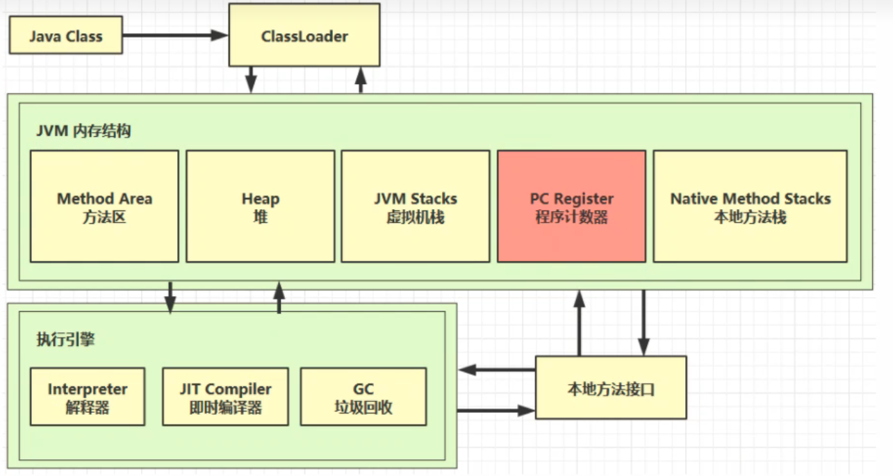

## 1、JVM内存结构

### 1.1 程序计数器

+ 定义：Program Counter Register 程序计数器（寄存器）

+ JAVA源码执行流程：JVM首先将Java源码转化为二进制字节码，也就是JVM指令，经过解释器转换为机器码，再交由CPU执行。

+ 作用：程序计数器在这个过程中会记录下一条JVM指令的执行地址。物理上的实现是通过寄存器实现的。
+ 特点：
  + 程序计数器是线程私有的。多个线程执行代码时，每个线程会有一个程序计数器。当CPU分配的时间片执行完毕后，如果线程代码没有执行完毕，则会由程序计数器记录JVM指令执行地址，等待下次线程调用继续执行。
  + 不会存在内存溢出

### 1.2 虚拟机栈

栈的数据结构特点为先进后出，后进先出

JAVA Virtual Machine Stacks（Java虚拟机栈）

+ 每个线程运行时所需的内存，称为虚拟机栈
+ 每个栈由多个栈帧（Frame）组成，对应着每次方法调用时所占的内存
+ 每个线程只能由一个活动栈，对应着正在执行的那个方法

#### 1.2.1 栈内存溢出

导致栈内存溢出（Java.lang.StackOverFlowError）原因：

+ 栈帧过多导致栈内存溢出（递归结束条件有问题可能出现）
+ 栈帧过大导致栈内存溢出

### 1.3 本地方法栈

Native Method Stacks：给本地方法的运行提供内存空间

### 1.4 堆

#### 1.4.1 定义

Heap：

+ 通过new关键字创建的对象都会使用堆内存
+ 特点：
  + 堆是线程共享的，堆中的对象都需要考虑线程安全问题
  + 有垃圾回收机制

#### 1.4.2 堆内存溢出

导致堆内存溢出（java.lang.OutOfMemoryError）原因：

+ 不断产生新对象，且新对象有方法使用，此时gc无法回收，则会导致堆内存溢出 

### 1.5 方法区

#### 1.5.1 定义

《Java 虚拟机规范》中明确说明：“尽管所有的方法区在逻辑上是属于堆的一部分，但一些简单的实现可能不会选择区进行垃圾收集或者进行压缩。” 但对于 HotSpotJVM 而言，方法区还有一个别名叫做 Non-Heap(非堆），目的就是要和堆分开。所以**方法区看作是一块独立于 Java 堆的内存空间**。

- **方法区的基本理解：**

1. 方法区（Method Area) 与 Java 堆一样，是各个线程共享的内存区域。
2. 方法区在 JVM 启动的时候创建，并且它的实际的物理内存空间和 Java 堆区一样都可以是不连续的。
3. 方法区的大小，跟堆空间一样，可以选择固定大小或者可扩展。
4. 方法区的大小决定了系统可以保存多少个类，如果系统定义了太多的类，导致方法区的溢出，虚拟机同样会抛出内存溢出错误： java.lang.OutOfMemoryError:PermGen space 或者 java.lang.OutOfMemoryError:Metaspace
5. 关闭 JVM 就会释放这个内存区域。

#### 1.5.2 方法区内存溢出

+ JDK1.8之前会导致永久代内存溢出
+ JDK1.8之后会导致元空间内存溢出

#### 1.5.3 运行时常量池

+ 常量池：就是一张表，虚拟机指令根据这张表找到要执行的类名、方法名、参数类型、字面量等信息
+ 运行时常量池，常量是*.class文件的。当该类被加载时，他的常量池信息就会放入运行时的常量池，并把里面的符号地址变为真实的地址

#### 1.5.4 StringTable

```java
// 常量池中的信息，都会被加载到运行时常量池中，这时a b ab都是常量池中的符号，还没有变成java字符串对象
// 在变成对象之前会新建StringTable，初始为空
// ldc #2 会把a符号变为"a"字符串对象，加入串池
// ldc #3 会把a符号变为"b"字符串对象，加入串池
// ldc #4 会把a符号变为"ab"字符串对象，加入串池
// StringTable['a', 'b', 'ab']  串池是hashtable结构，不能扩容
public static void main(String[] args) {
    String s1 = "a";
    String s2 = "b";
    String s3 = "ab";
}
```

经过编译后使用javap命令反编译后得到下图：

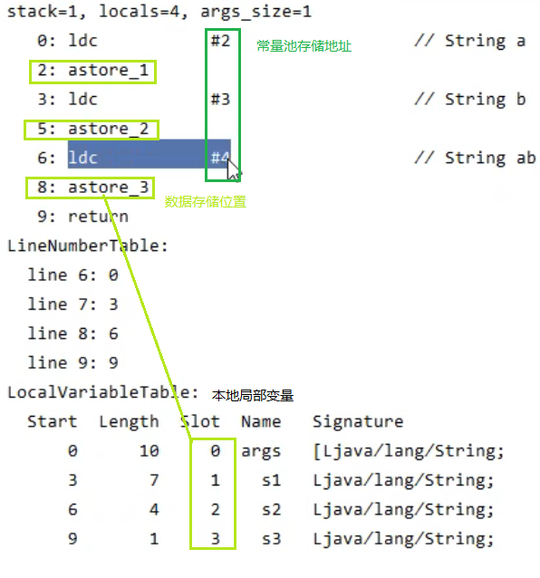

```java
public static void main(String[] args) {
    String s1 = "a";
    String s2 = "b";
    String s3 = "ab";

    String s4 = s1 + s2;    // new StringBuilder().append("a").append("b").toString()
    System.out.println(s3 == s4);	// 此处返回的一定是false
}
```

s4 = s1+s2操作实际上是在堆上新建了字符串，而s3是在串池中，==判断的是字符串的地址，因此返回的一定是false

```java
public static void main(String[] args) {
    String s1 = "a";
    String s2 = "b";
    String s3 = "ab";

    String s4 = s1 + s2;    // new StringBuilder().append("a").append("b").toString()
    String s5 = "a" + "b";	// javac在编译期间的优化，结果已经在编译期间确定为ab
    System.out.println(s3 == s5);
}
```

反编译的字节码

```java
  public static void main(java.lang.String[]);
    descriptor: ([Ljava/lang/String;)V
    flags: ACC_PUBLIC, ACC_STATIC
    Code:
      stack=2, locals=6, args_size=1
         0: ldc           #7                  // String a
         2: astore_1
         3: ldc           #9                  // String b
         5: astore_2
         6: ldc           #11                 // String ab
         8: astore_3
         9: aload_1
        10: aload_2
        11: invokedynamic #13,  0             // InvokeDynamic #0:makeConcatWithConstants:(Ljava/lang/String;Ljava/lang/String;)Ljava/lang/String;
        16: astore        4
        18: ldc           #11                 // String ab->到常量池中寻找编号为#11的符号（就是ab）
        20: astore        5
        22: return
      LineNumberTable:
        line 5: 0
        line 6: 3
        line 7: 6
        line 9: 9
        line 10: 18
        line 11: 22
      LocalVariableTable:
        Start  Length  Slot  Name   Signature
            0      23     0  args   [Ljava/lang/String;
            3      20     1    s1   Ljava/lang/String;
            6      17     2    s2   Ljava/lang/String;
            9      14     3    s3   Ljava/lang/String;
           18       5     4    s4   Ljava/lang/String;
           22       1     5    s5   Ljava/lang/String;
}
```

`String s5 = "a" + "b";`对应的字节码中的18行，`String s3 = "ab";`对应字节码中的6、8行具体操作都是在常量池中寻找编号为#11的`ab`符号，所以在`System.out.println(s3 == s5);`时，一定为true。因为s3和s5都指向串池中的地址

**StringTable特性**：

+ 常量池中的字符串仅仅是符号，第一次用到时才变为对象

+ 利用串池的机制，来避免重复创建字符串对象

+ 字符串变量拼接的原理时StringBuilder

+ 字符串常量的拼接原理是编译期优化

+ 可以使用intern方法，主动将串池中没有的字符串对象放入串池中

  + jdk1.8：将字符串尝试放入串池，如果有则不会放入并返回串池中的对象，没有则放入串池并返回串池中的对象 
  + jdk1.6：将字符串尝试放入串池，如果有则不会放入，没有则复制字符串放入串池原始字符串仍存放在堆中

  ```java
  public static void main(String[] args) {
      // StringTable["a", "b"]
      //str放入堆中                   a放入串池中                  b放入串池中
      String str = new String("a") + new String("b");
      // new String("b")、new String("a")的值和串池相等，但是不是同一个对象
      // str这个时候的值是”ab“，但是这个值现在存放在堆中，没有存放到串池中
  
      
  
      // StringTable["a", "b", "ab"]
      String s2 = str.intern();   // 尝试将这个字符串对象放入串池中，如果有则不会放入，没有则放入串池，并把串池中的对象返回
      // 简单说就是s2引用的就是串池中的对象
  
      System.out.println(s2 == "ab");	// true
      System.out.println(str == "ab");	// true
  }
  ```

  ```java
  public static void main(String[] args) {
          // StringTable["a", "b"]
          String str = new String("a") + new String("b");
          // StringTable["a", "b", "ab"]
          System.out.println(str == "ab");    // 此处串池添加ab，但是现在地址不同 false
          String s2 = str.intern();   // 尝试加入串池，但是已经存在ab，加入失败，但是会返回s2，也就是串池中的ab，str还是在堆中
          System.out.println(s2 == "ab"); // 地址相同 true
          System.out.println(str == "ab");    // 地址不同 false
      }
  ```

**StringTable位置**

jdk1.6 StringTable 位置是在永久代中，1.8 StringTable 位置是在堆中。

#### 1.5.4 StringTable垃圾回收机制

+ -Xmx10m 指定堆内存大小
+ -XX:+PrintStringTableStatistics 打印字符串常量池信息
+ -XX:+PrintGCDetails
+ -verbose:gc 打印 gc 的次数，耗费时间等信息

```java
/**
 * 演示 StringTable 垃圾回收
 * -Xmx10m -XX:+PrintStringTableStatistics -XX:+PrintGCDetails -verbose:gc
 */
public class Code_05_StringTableTest {

    public static void main(String[] args) {
        int i = 0;
        try {
            for(int j = 0; j < 10000; j++) { // j = 100, j = 10000
                String.valueOf(j).intern();
                i++;
            }
        }catch (Exception e) {
            e.printStackTrace();
        }finally {
            System.out.println(i);
        }
    }
}
```

#### 1.5.5 StringTable性能调优

+ 因为StringTable是由HashTable实现的，所以可以适当增加HashTable桶的个数，来减少字符串放入串池所需要的时间
  `-XX:StringTableSize=桶个数（最少设置为 1009 以上）`
+ 考虑是否需要将字符串对象入池。可以通过 intern 方法减少重复入池

### 1.6 直接内存

#### 1.6.1 定义

Direct Memory

- 常见于 NIO 操作时，用于数据缓冲区
- 分配回收成本较高，但读写性能高
- 不受 JVM 内存回收管理

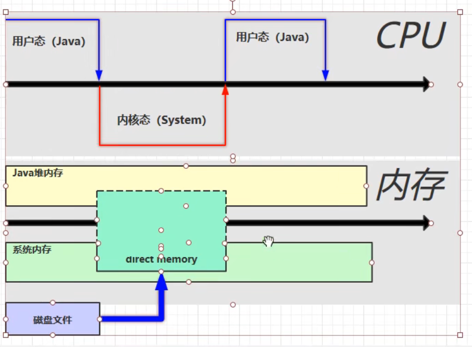

通常，正常的IO操作需要在内存中分配出JAVA堆内存和系统内存，Java代码无法直接访问系统内存中的数据。读取磁盘文件后，文件先存储在系统内存中，之后再拷贝到Java堆内存中，一份数据复制了两份。Direct Memory是Java代码可以直接访问的一块内存区域，从磁盘中读取的文件直接复制到Direct Memory中，避免多次复制影响性能

#### 1.6.2 直接内存回收原理

```java
public static int _1GB = 1024 * 1024 * 1024;

public static void main(String[] args) throws IOException, NoSuchFieldException, IllegalAccessException {
    //        method();
    method1();
}

// 直接内存 是被 unsafe 创建与回收
private static void method1() throws IOException, NoSuchFieldException, IllegalAccessException {

    Field field = Unsafe.class.getDeclaredField("theUnsafe");
    field.setAccessible(true);
    Unsafe unsafe = (Unsafe)field.get(Unsafe.class);

    long base = unsafe.allocateMemory(_1GB);
    unsafe.setMemory(base,_1GB, (byte)0);
    System.in.read();

    unsafe.freeMemory(base);
    System.in.read();
}

// 直接内存被 释放
private static void method() throws IOException {
    ByteBuffer byteBuffer = ByteBuffer.allocateDirect(_1GB);
    System.out.println("分配完毕");
    System.in.read();
    System.out.println("开始释放");
    byteBuffer = null;
    System.gc(); // 手动 gc
    System.in.read();
}
```

直接内存的回收不是通过 JVM 的垃圾回收来释放的，而是通过unsafe.freeMemory 来手动释放。

1. allocateDirect 的实现，底层是创建了一个 DirectByteBuffer 对象。

   ```java
   public static ByteBuffer allocateDirect(int capacity) {
       return new DirectByteBuffer(capacity);
   }
   ```

2. DirectByteBuffer 类

   ```java
   DirectByteBuffer(int cap) {   // package-private
      
       super(-1, 0, cap, cap);
       boolean pa = VM.isDirectMemoryPageAligned();
       int ps = Bits.pageSize();
       long size = Math.max(1L, (long)cap + (pa ? ps : 0));
       Bits.reserveMemory(size, cap);
   
       long base = 0;
       try {
           base = unsafe.allocateMemory(size); // 申请内存
       } catch (OutOfMemoryError x) {
           Bits.unreserveMemory(size, cap);
           throw x;
       }
       unsafe.setMemory(base, size, (byte) 0);
       if (pa && (base % ps != 0)) {
           // Round up to page boundary
           address = base + ps - (base & (ps - 1));
       } else {
           address = base;
       }
       cleaner = Cleaner.create(this, new Deallocator(base, size, cap)); // 通过虚引用，来实现直接内存的释放，this为虚引用的实际对象, 第二个参数是一个回调，实现了 runnable 接口，run 方法中通过 unsafe 释放内存。
       att = null;
   }
   ```

   这里调用了一个 Cleaner 的 create 方法，且后台线程还会对虚引用的对象监测，如果虚引用的实际对象（这里是 DirectByteBuffer ）被回收以后，就会调用 Cleaner 的 clean 方法，来清除直接内存中占用的内存。

   ```java
   public void clean() {
       if (remove(this)) {
           try {
               // 都用函数的 run 方法, 释放内存
               this.thunk.run();
           } catch (final Throwable var2) {
               AccessController.doPrivileged(new PrivilegedAction<Void>() {
                   public Void run() {
                       if (System.err != null) {
                           (new Error("Cleaner terminated abnormally", var2)).printStackTrace();
                       }
                       System.exit(1);
                       return null;
                   }
               });
           }
       }
   }
   ```

   可以看到关键的一行代码， this.thunk.run()，thunk 是 Runnable 对象。run 方法就是回调 Deallocator 中的 run 方法

   ```java
   public void run() {
       if (address == 0) {
           // Paranoia
           return;
       }
       // 释放内存
       unsafe.freeMemory(address);
       address = 0;
       Bits.unreserveMemory(size, capacity);
   }
   
   ```

**直接内存的回收机制总结:**

+ 使用了 Unsafe 类来完成直接内存的分配回收，回收需要主动调用freeMemory 方法
+ ByteBuffer 的实现内部使用了 Cleaner（虚引用）来监测ByteBuffer对象。一旦ByteBuffer 被垃圾回收，那么会由 ReferenceHandler（守护线程） 来调用 Cleaner 的 clean 方法调用 freeMemory 来释放直接内存

**注意：**

一般用 jvm 调优时，会加上下面的参数：

`-XX:+DisableExplicitGC  // 静止显示的 GC`
意思就是禁止我们手动的 GC，比如手动 System.gc() 无效，它是一种 full gc，会回收新生代、老年代，会造成程序执行的时间比较长。所以我们就通过 unsafe 对象调用 freeMemory 的方式释放内存。

### 1.7 垃圾回收

#### 1.7.1 如何判断对象可以回收

1. 引用计数法：当一个对象被引用时，就当引用对象的值加一，当值为 0 时，就表示该对象不被引用，可以被垃圾收集器回收。

   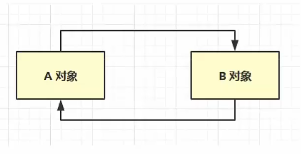

   但是也存在弊端，两个对象循环引用时，两个对象的计数都为0，会导致两个对象都无法被回收

2. 可达性分析算法：

   + JVM 中的垃圾回收器通过可达性分析来探索所有存活的对象
   + 扫描堆中的对象，看能否沿着 GC Root 对象为起点的引用链找到该对象，如果找不到，则表示可以回收
   + 可以作为 GC Root 的对象
     + 虚拟机栈（栈帧中的本地变量表）中引用的对象。
     + 方法区中类静态属性引用的对象
     + 方法区中常量引用的对象
     + 本地方法栈中 JNI（即一般说的Native方法）引用的对象

```java
public static void main(String[] args) throws IOException {
	//           栈帧，存在栈中     存放在堆中  
    ArrayList<Object> list = new ArrayList<>();	// 局部变量的引用
    list.add("a");
    list.add("b");
    list.add(1);
    System.out.println(1);
    System.in.read();

    list = null;	// 引用置为空，被gc回收
    System.out.println(2);
    System.in.read();
    System.out.println("end");
}
```

3. 四种引用

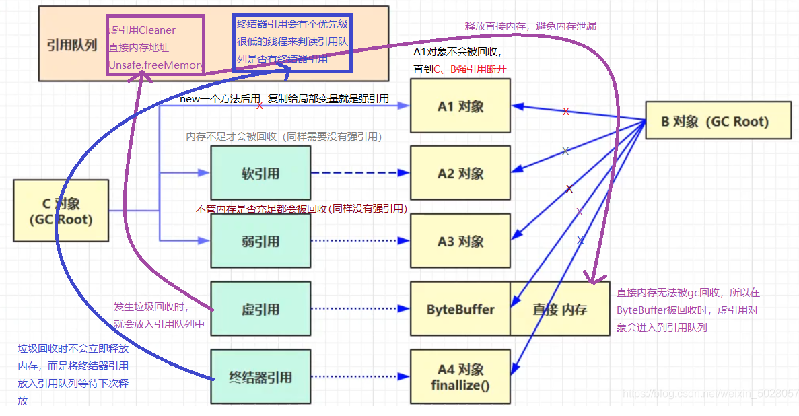

+ **强引用：**比如新建了对象并且用 = 赋值给了变量，就是强引用。只有所有 GC Roots 对象都不通过【强引用】引用该对象，该对象才能被垃圾回收
+ **软引用（SoftReference）：**仅有软引用引用该对象时，在垃圾回收后，内存仍不足时会再次出发垃圾回收，回收软引用对象。可以配合引用队列来释放软引用自身
+ **弱引用（WeakReference）：**仅有弱引用引用该对象时，在垃圾回收时，无论内存是否充足，都会回收弱引用对象。可以配合引用队列来释放弱引用自身
+ **虚引用（PhantomReference）：**必须配合引用队列使用，主要配合 ByteBuffer 使用，被引用对象回收时，会将虚引用入队，由 Reference Handler 线程调用虚引用相关方法释放直接内存
+ **终结器引用（FinalReference）：**无需手动编码，但其内部配合引用队列使用，在垃圾回收时，终结器引用入队（被引用对象暂时没有被回收），再由 Finalizer 线程通过终结器引用找到被引用对象并调用它的 finalize 方法，第二次 GC 时才能回收被引用对象。

一些示例：

```java
// 强引用导致虚拟机内存不足
private static final int _4MB = 1024 * 1024 * 4;
public static void main(String[] args) throws IOException {
    // -Xmx20m -XX:+PrintGCDetails -verbose:gc
    List<byte[]> list = new ArrayList<byte[]>();
    for (int i = 0; i < 5; i++) {
        list.add(new byte[_4MB]);
    }
    System.in.read();
} 
// Exception in thread "main" java.lang.OutOfMemoryError: Java heap space
```

```java
// 软引用
public static void main(String[] args) throws IOException {
    // -Xmx20m -XX:+PrintGCDetails -verbose:gc
    //   强引用           软引用
    // list-->SoftReference-->byte[]
    List<SoftReference<byte[]>> list = new ArrayList<>();
    for (int i = 0; i < 5; i++) {
        SoftReference<byte[]> ref = new SoftReference<>(new byte[_4MB]);
        System.out.println(ref.get());
        list.add(ref);
        System.out.println(list.size());
    }
    System.out.println("循环结束");
    for (SoftReference<byte[]> softReference : list) {
        System.out.println(softReference.get());
    }
}

// 
[B@1540e19d
1
[B@677327b6
2
[B@14ae5a5
3
[GC (Allocation Failure) [PSYoungGen: 2207K->480K(6144K)] 14495K->13108K(19968K), 0.0008372 secs] [Times: user=0.00 sys=0.00, real=0.00 secs] // 内存紧张触发一次gc
[B@7f31245a
4 	// 打印4之前已经将字节加入数组
// 尝试加入第五个元素时内存不足，触发fullGC，将软引用对象回收
[GC (Allocation Failure) --[PSYoungGen: 4688K->4688K(6144K)] 17316K->17348K(19968K), 0.0011063 secs] [Times: user=0.00 sys=0.00, real=0.00 secs] 
[Full GC (Ergonomics) [PSYoungGen: 4688K->4531K(6144K)] [ParOldGen: 12660K->12584K(13824K)] 17348K->17116K(19968K), [Metaspace: 3436K->3436K(1056768K)], 0.0047128 secs] [Times: user=0.00 sys=0.00, real=0.00 secs] 
[GC (Allocation Failure) --[PSYoungGen: 4531K->4531K(6144K)] 17116K->17164K(19968K), 0.0004312 secs] [Times: user=0.00 sys=0.00, real=0.00 secs] 
[Full GC (Allocation Failure) [PSYoungGen: 4531K->0K(6144K)] [ParOldGen: 12632K->713K(9216K)] 17164K->713K(15360K), [Metaspace: 3436K->3436K(1056768K)], 0.0050665 secs] [Times: user=0.00 sys=0.00, real=0.01 secs] 
[B@6d6f6e28
5
循环结束
null
null
null
null
// 所以前四个对象为null
[B@6d6f6e28	// 第五次循环内存足够，加入list
```

```java
// 清除已被删除的软引用
public static void main(String[] args) throws IOException {
    // -Xmx20m -XX:+PrintGCDetails -verbose:gc
    //   强引用           软引用
    // list-->SoftReference-->byte[]
    List<SoftReference<byte[]>> list = new ArrayList<>();

    // 引用队列
    ReferenceQueue<byte[]> queue = new ReferenceQueue<>();

    for (int i = 0; i < 5; i++) {
        // 关联引用队列,当软引用所关联的byte数组被回收时，软引用对象本身就会被加入引用队列中
        SoftReference<byte[]> ref = new SoftReference<>(new byte[_4MB], queue);
        System.out.println(ref.get());
        list.add(ref);
        System.out.println(list.size());
    }
    System.out.println("循环结束");
	
    // 从队列中获取无用的软引用对象并移除
    Reference<? extends byte[]> poll = queue.poll();
    while (poll != null) {
        list.remove(poll);
        poll = queue.poll();
    }

    for (SoftReference<byte[]> softReference : list) {
        System.out.println(softReference.get());
    }
}

// 输出：[B@6d6f6e28
```

```java
public static void main(String[] args) {
    //        method1();
    method2();
}

public static int _4MB = 4 * 1024 *1024;

// 演示 弱引用
public static void method1() {
    List<WeakReference<byte[]>> list = new ArrayList<>();
    for(int i = 0; i < 10; i++) {
        WeakReference<byte[]> weakReference = new WeakReference<>(new byte[_4MB]);
        list.add(weakReference);

        for(WeakReference<byte[]> wake : list) {
            System.out.print(wake.get() + ",");
        }
        System.out.println();
    }
}

// 演示 弱引用搭配 引用队列
public static void method2() {
    List<WeakReference<byte[]>> list = new ArrayList<>();
    ReferenceQueue<byte[]> queue = new ReferenceQueue<>();

    for(int i = 0; i < 9; i++) {
        WeakReference<byte[]> weakReference = new WeakReference<>(new byte[_4MB], queue);
        list.add(weakReference);
        for(WeakReference<byte[]> wake : list) {
            System.out.print(wake.get() + ",");
        }
        System.out.println();
    }
    System.out.println("===========================================");
    Reference<? extends byte[]> poll = queue.poll();
    while (poll != null) {
        list.remove(poll);
        poll = queue.poll();
    }
    for(WeakReference<byte[]> wake : list) {
        System.out.print(wake.get() + ",");
    }
}
```

#### 1.7.2 垃圾回收算法

1. 标记清除算法 Mark Sweep

   标记清除算法速度快，但是会产生内存碎片。因为清理完的内存不会进行整理，而是在空闲地址表中记录内存地址，等需要内存时就去地址表中寻找。可能会造成内存浪费。

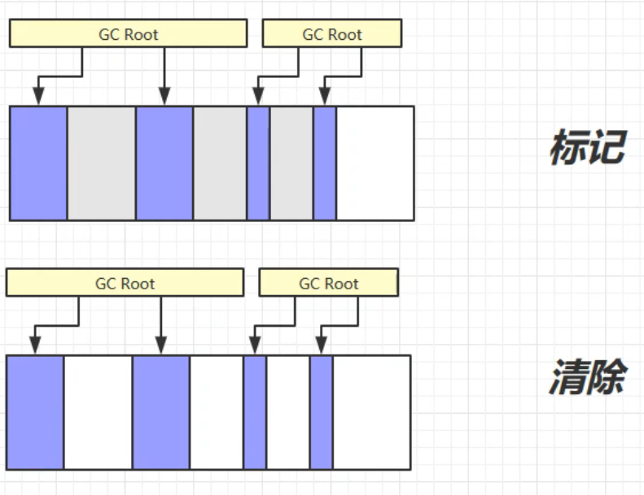

2. 标记整理 Mark Compact

   标记整理算法速度慢，因为在整理期间对变量的引用需要更改所引用的内存地址。但是没有内存碎片的问题。

   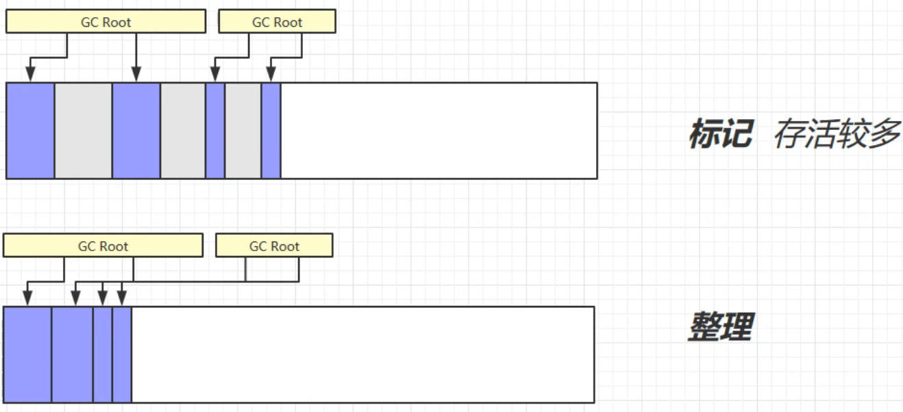

3. 复制算法 Copy

   复制算法把内存区域划分成大小相同的两块内存区域（FROM，TO），当FROM内存区域产生垃圾时，会把GC Root引用的变量复制到TO内存区域中，然后把FROM内存区域直接回收，再调转FROM和TO内存区域。也就是说始终保持TO区域是空闲的

   复制算法不会产生内存碎片，但是会将可用的内存缩小为原来的一半

   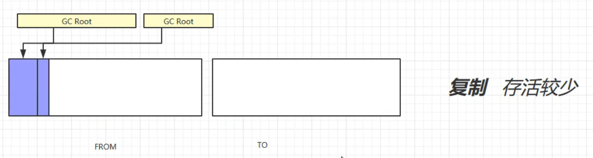

#### 1.7.3 分代回收算法

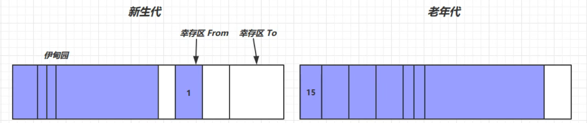

+ 新创建的对象首先会被分配到新生代的Eden区内
+ 当创建对象过多，Eden内存不足时，会出发Mintor GC，将Eden和幸存区From中存活的对象采用复制算法复制到To中，将存活对象的年龄+1，然后交换From区、To区
+ Mintor GC会出发stop the world，暂停其他线程（因为在交换分区时会改变对象地址），等待垃圾回收线程结束后恢复用户线程运行
+ 当幸存区From对象的寿命超过阈值时，会被加入到老年代，最大的寿命是15（4bit）
+ 当老年代内存不足时，会先触发Mintor GC，如果空间仍然不足，就会触发Full GC，那么stop the world的时间更长

---

<h4>相关JVM参数</h4>

|        含义        |                             参数                             |
| :----------------: | :----------------------------------------------------------: |
|     堆初始大小     |                             -Xms                             |
|     堆最大大小     |                 -Xmx 或 -XX:MaxHeapSize=size                 |
|     新生代大小     |      -Xmn 或 (-XX:NewSize=size + -XX:MaxNewSize=size )       |
| 幸存区比例（动态） | -XX:InitialSurvivorRatio=ratio 和 -XX:+UseAdaptiveSizePolicy |
|     幸存区比例     |                   -XX:SurvivorRatio=ratio                    |
|      晋升阈值      |              -XX:MaxTenuringThreshold=threshold              |
|      晋升详情      |                -XX:+PrintTenuringDistribution                |
|       GC详情       |               -XX:+PrintGCDetails -verbose:gc                |
| FullGC 前 MinorGC  |                  -XX:+ScavengeBeforeFullGC                   |

---

<h4>GC分析</h4>

```java
private static final int _512KB = 512 * 1024;
    private static final int _1MB = 1024 * 1024;
    private static final int _6MB = 6 * 1024 * 1024;
    private static final int _7MB = 7 * 1024 * 1024;
    private static final int _8MB = 8 * 1024 * 1024;

    // -Xms20m -Xmx20m -Xmn10m -XX:+UseSerialGC -XX:+PrintGCDetails -verbose:gc
    public static void main(String[] args) {
        
    }
}
// 堆内存占用清空如下图
```

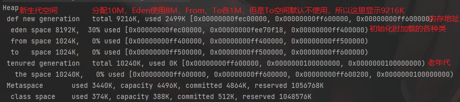

```java
private static final int _512KB = 512 * 1024;
private static final int _1MB = 1024 * 1024;
private static final int _6MB = 6 * 1024 * 1024;
private static final int _7MB = 7 * 1024 * 1024;
private static final int _8MB = 8 * 1024 * 1024;

// -Xms20m -Xmx20m -Xmn10m -XX:+UseSerialGC -XX:+PrintGCDetails -verbose:gc
public static void main(String[] args) {
    List<byte[]> list = new ArrayList<>();
    list.add(new byte[_6MB]);
    list.add(new byte[_512KB]);
    list.add(new byte[_6MB]);
    list.add(new byte[_512KB]);
    list.add(new byte[_6MB]);
}
```

---

<h4>大对象</h4>

当有较大对象无法放入到新生代中，会直接晋升到老年代。当再有大对象时，会直接提示堆内存不足异常

#### 1.7.4 垃圾回收器

**相关概念：**

+ 并行收集：指多条垃圾收集线程并行工作，但此时用户线程仍处于等待状态。
+ 并发收集：指用户线程与垃圾收集线程同时工作（不一定是并行的可能会交替执行）。用户程序在继续运行，而垃圾收集程序运行在另一个 CPU 上
+ 吞吐量：即 CPU 用于运行用户代码的时间与 CPU 总消耗时间的比值（吞吐量 = 运行用户代码时间 / ( 运行用户代码时间 + 垃圾收集时间 )），也就是。例如：虚拟机共运行 100 分钟，垃圾收集器花掉 1 分钟，那么吞吐量就是 99% 。

1. **串行**

   + 底层是单线程

   + 适用于堆内存较小的情况

     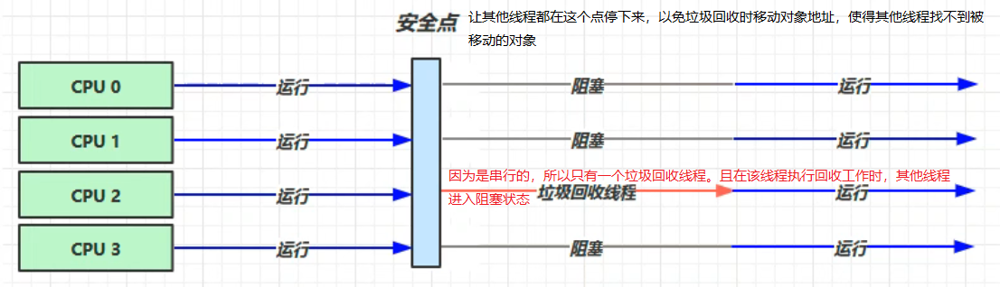

     ```java
     // 虚拟机参数
     -XX:+UseSerialGC=serial + serialOld
     ```

     + Serial 收集器
       Serial 收集器是最基本的、发展历史最悠久的收集器
       特点：单线程、简单高效（与其他收集器的单线程相比），采用复制算法。对于限定单个 CPU 的环境来说，Serial 收集器由于没有线程交互的开销，专心做垃圾收集自然可以获得最高的单线程收集效率。收集器进行垃圾回收时，必须暂停其他所有的工作线程，直到它结束（Stop The World）！

     + ParNew 收集器
       ParNew 收集器其实就是 Serial 收集器的多线程版本
       特点：多线程、ParNew 收集器默认开启的收集线程数与CPU的数量相同，在 CPU 非常多的环境中，可以使用 -XX:ParallelGCThreads 参数来限制垃圾收集的线程数。和 Serial 收集器一样存在 Stop The World 问题

     + Serial Old 收集器
       Serial Old 是 Serial 收集器的老年代版本
       特点：同样是单线程收集器，采用标记-整理算法

2. **吞吐量优先**（并行，垃圾回收时阻塞线程）

   + 多线程

   + 适用于堆内存较大，多核 cpu

   + 让单位时间内，STW 的时间最短 0.2 0.2 = 0.4

     ```java
     // 虚拟机参数
     -XX:+UseParallelGC ~ -XX:+UsePrallerOldGC	// 开启并行垃圾回收器 （垃圾回收时阻塞用户线程）
     // UseParallelGC新生代垃圾回收器，复制算法			UsePrallerOldGC老年代垃圾回收期，标记整理算法
         
     -XX:+UseAdaptiveSizePolicy	// 采用自适应大小调整策略（调整新生代大小）
     -XX:GCTimeRatio=ratio// 调整吞吐量：1/(1+radio) radio默认为99，实际含义就是垃圾回收时间不能超过总时间1%。达不到目标的话GC会尝试增加堆的大小
     -XX:MaxGCPauseMillis=ms // 最大暂停毫秒数：默认200ms
         
     -XX:ParallelGCThreads=n	// 可以调整垃圾回收线程数
     ```

     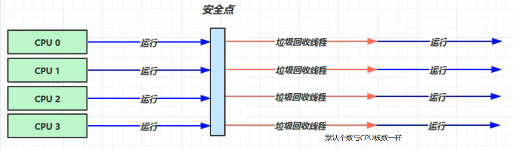

     + Parallel Scavenge 收集器
       与吞吐量关系密切，故也称为吞吐量优先收集器
       **特点**：属于新生代收集器也是采用复制算法的收集器（用到了新生代的幸存区），又是并行的多线程收集器（与 ParNew 收集器类似）

       该收集器的目标是达到一个可控制的吞吐量。还有一个值得关注的点是：GC自适应调节策略（与 ParNew 收集器最重要的一个区别）

       GC自适应调节策略：

       + Parallel Scavenge 收集器可设置 `-XX:+UseAdptiveSizePolicy` 参数。
         当开关打开时不需要手动指定新生代的大小（-Xmn）、Eden 与 Survivor 区的比例（-XX:SurvivorRation）、晋升老年代的对象年龄

         (-XX:PretenureSizeThreshold）等，虚拟机会根据系统的运行状况收集性能监控信息，动态设置这些参数以提供最优的停顿时间和最高的吞吐量，这种调节方式称为 GC 的自适应调节策略。

       Parallel Scavenge 收集器使用两个参数控制吞吐量：

       + XX:MaxGCPauseMillis=ms 控制最大的垃圾收集停顿时间（默认200ms）
       + XX:GCTimeRatio=rario 直接设置吞吐量的大小

     + Parallel Old 收集器
       是 Parallel Scavenge 收集器的老年代版本
       特点：多线程，采用标记-整理算法（老年代没有幸存区）

3. **响应时间优先**

   + 多线程

   + 适用于堆内存较大，多核 cpu

   + 尽可能让 STW 的单次时间最短 0.1 0.1 0.1 0.1 0.1 = 0.5

     ```java
     // 虚拟机参数
     -XX:+UseConcMarkSweepGC ~ -XX:+UseParNewGC ~ SerialOld	
     // UseConcMarkSweepGC并发，垃圾回收和用户线程同时进行（运行在老年代）      UseParNewGC运行在新生代
     // 因为CMS是标记清理算法，可能会导致内存碎片过多引起并发失败，失败后就会退化为SerialOld	算法进行内存整理
     -XX:ParallelGCThreads=n ~ -XX:ConcGCThreads=threads	
     // ParallelGCThreads并行线程数   ConcGCThreads并发垃圾回收数（1/4核心数）
     -XX:CMSInitiatingOccupancyFraction=percent	// 控制何时CMS垃圾回收。当内存占用到80%时就回收。为了给浮动垃圾一些存储空间
     -XX:+CMSScavengeBeforeRemark	// 重新标记前对新生代做一次垃圾回收
     ```

     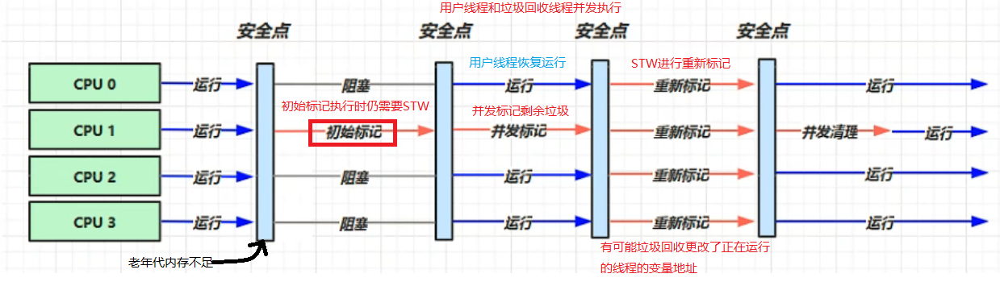

     + CMS 收集器
       Concurrent Mark Sweep，一种以获取最短回收停顿时间为目标的老年代收集器
       **特点**：基于标记-清除算法实现。并发收集、低停顿，但是会产生内存碎片
       **应用场景**：适用于注重服务的响应速度，希望系统停顿时间最短，给用户带来更好的体验等场景下。如 web 程序、b/s 服务
       CMS 收集器的运行过程分为下列4步：
       + 初始标记：标记 GC Roots 能直接到的对象。速度很快但是仍存在 Stop The World 问题。
       + 并发标记：进行 GC Roots Tracing 的过程，找出存活对象且用户线程可并发执行。
       + 重新标记：为了修正并发标记期间因用户程序继续运行而导致标记产生变动的那一部分对象的标记记录。仍然存在 Stop The World 问题
       + 并发清除：对标记的对象进行清除回收，清除的过程中，可能任然会有新的垃圾产生，这些垃圾就叫浮动垃圾，如果当用户需要存入一个很大的对象时，新生代放不下去，老年代由于浮动垃圾过多，就会退化为 serial Old 收集器，将老年代垃圾进行标记-整理，当然这也是很耗费时间的！

     + CMS 收集器的内存回收过程是与用户线程一起并发执行的，可以搭配 ParNew 收集器（多线程，新生代，复制算法）与 Serial Old 收集器（单线程，老年代，标记-整理算法）使用。

			#### 1.7.5 G1（Garbage First）

**适用场景：**

- 同时注重吞吐量和低延迟（响应时间），默认的暂停时间为200ms
- 超大堆内存（内存大的），会将堆内存划分为多个大小相等的区域
- 整体上是标记-整理算法，两个区域之间是复制算法

**相关JVM参数**

```java
-XX:+UseG1GC
-XX:G1HeapRegionSize=size
-XX:MaxGCPauseMillis=time
```

1. **G1垃圾回收阶段**

   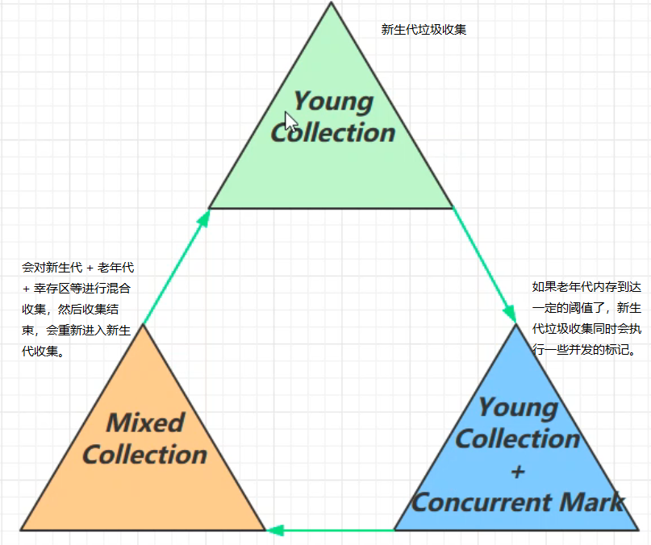

2. **Young Collection**

   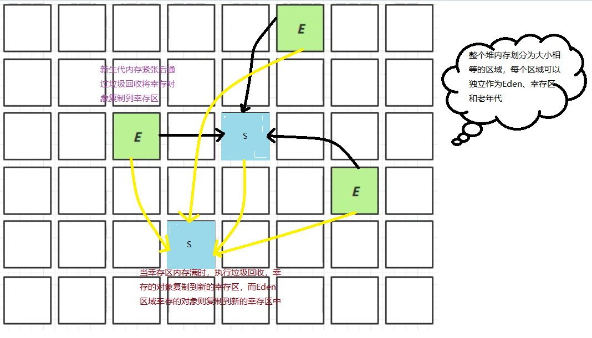

3. #### Young Collection + CM

   + 在Young GC时会进行GC Root的初始标记（不会占用并发标记时间）

   + 老年代占用堆空间比例到达阈值时，会进行并发标记（不会STW），由下面的JVM参数决定

     ```java
     -XX:InitiatingHeapOccupancyPercent=percent （默认45%）
     ```

     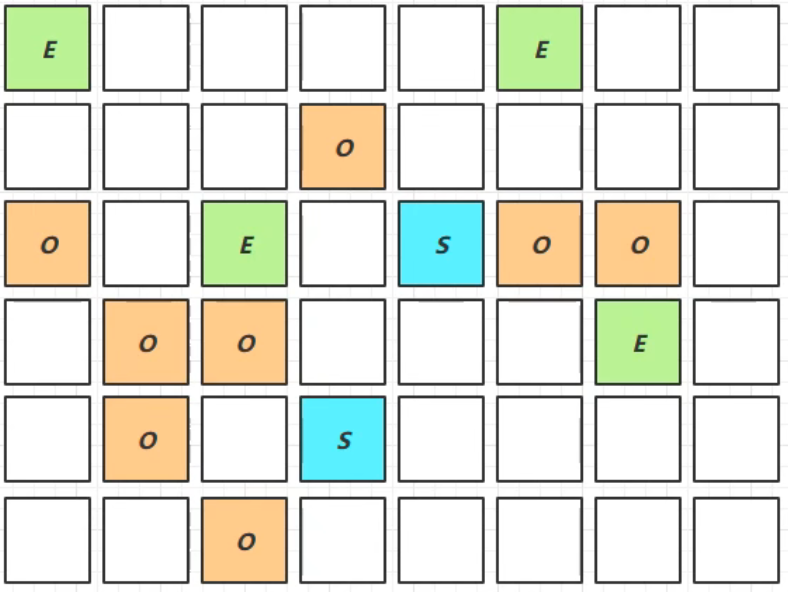

   ​        当老年代占用堆内存45%时，就会执行并发标记

4. #### Mixed Collection

   会对E、S、O进行**全面的垃圾回收**

   - 最终标记会 STW
   - 拷贝存活会 STW

   ```java
   -XX:MaxGCPauseMills=xxms 用于指定最长的停顿时间
   ```

   问：为什么有的老年代被拷贝了，有的没拷贝？
   因为指定了最大停顿时间，如果对所有老年代都进行回收，耗时可能过高。为了保证时间不超过设定的停顿时间，会回收最有价值的老年代（回收后，能够得到更多内存）

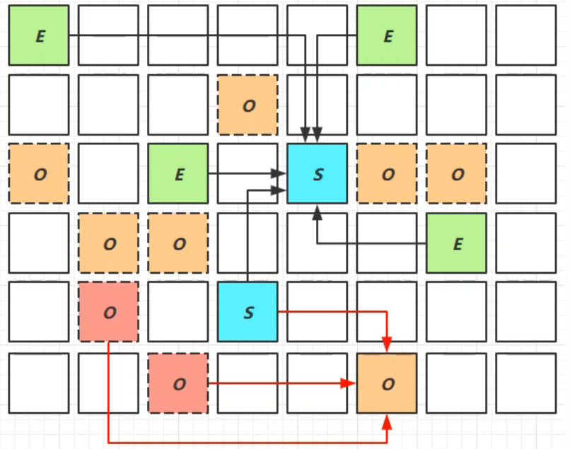

5. **Full GC**

   + SerialGC （串行）
     + 新生代内存不足时发生的垃圾收集 - minor gc
     + 老年代内存不足时发生的垃圾收集 - full gc
   + ParallelGC （并行）
     + 新生代内存不足时发生的垃圾收集 - minor gc
     + 老年代内存不足时发生的垃圾收集 - full gc

   + CMS （并发）
     + 新生代内存不足时发生的垃圾收集 - minor gc
     + 老年代内存不足时发生的垃圾收集：
       + 如果垃圾产生速度慢于垃圾回收速度，不会触发 Full GC，还是并发地进行清理
       + 如果垃圾产生速度快于垃圾回收速度，便会触发 Full GC，然后退化成 serial Old 收集器串行的收集，就会导致停顿的时候长。
   + G1（并发）
     + 新生代内存不足时发生的垃圾收集 - minor gc
     + 老年代内存不足时发生的垃圾收集：
       + 如果垃圾产生速度慢于垃圾回收速度，不会触发 Full GC，还是并发地进行清理
       + 如果垃圾产生速度快于垃圾回收速度，便会触发 Full GC，然后退化成 serial Old 收集器串行的收集，就会导致停顿的时候长。

6. **Young Collection 跨代引用**

   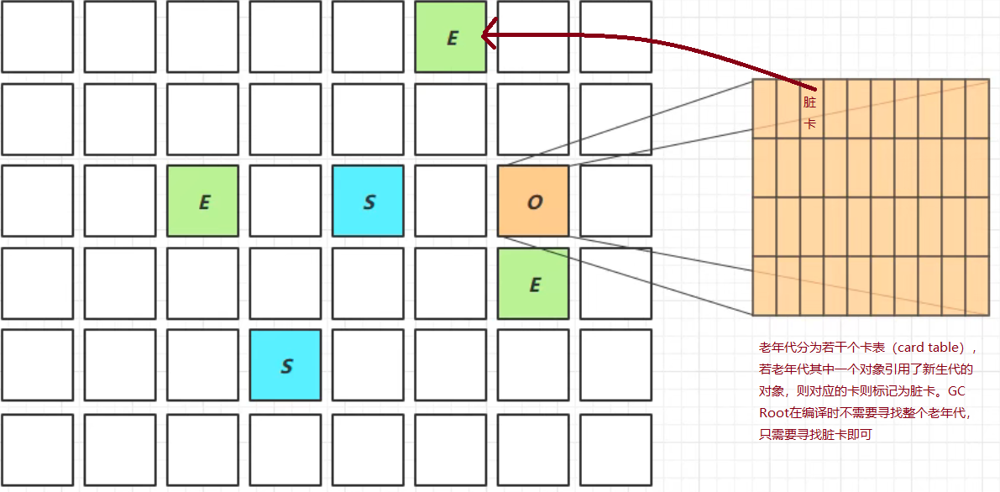

   + 卡表 与 Remembered Set
     + Remembered Set 存在于E中，用于保存新生代对象对应的脏卡
       + 脏卡：O 被划分为多个区域（一个区域512K），如果该区域引用了新生代对象，则该区域被称为脏卡
     + 在引用变更时通过 post-write barried + dirty card queue
     + concurrent refinement threads 更新 Remembered Set

## 2、类加载


### 2.1 字节码指令

Java中提供了javap工具反编译class文件

#### 2.1.1 图解方法执行流程

```java
public static void main(String[] args) {
    int a = 0;
    int b = Short.MAX_VALUE + 1;
    int c = a + b;
    System.out.println(c);
}
```

1. **常量池载入运行时常量池**
   常量池也属于方法区，只不过这里单独提出来了

   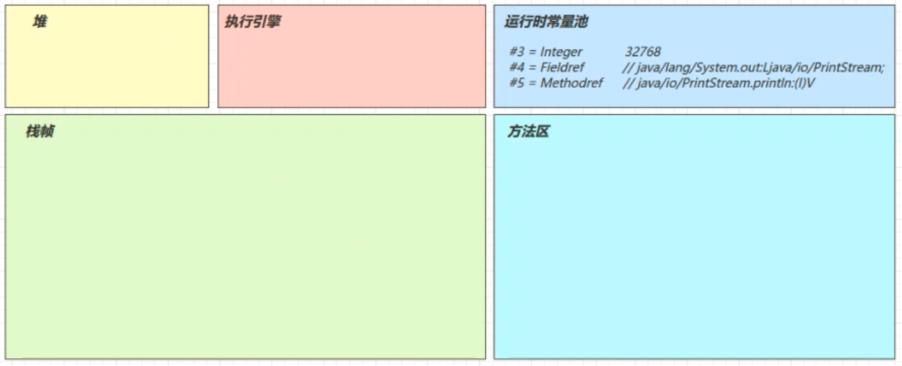

2. **方法字节码载入方法区**

   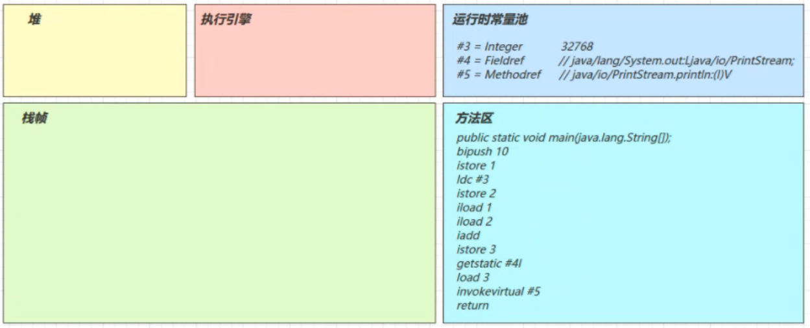

3. **main线程开始运行，分配栈帧内存**

   **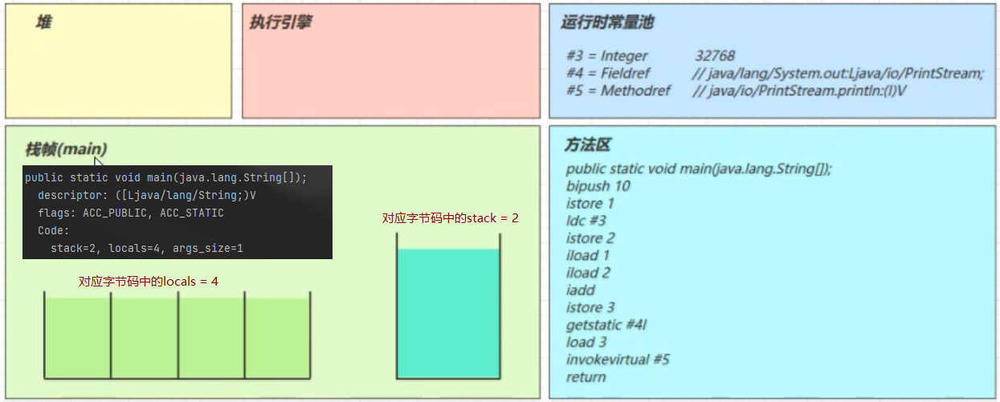**

4. **执行引擎开始执行字节码**

   **0: bipush        10**

   + 将一个 byte 压入操作数栈（其长度会补齐 4 个字节），类似的指令还有

     + sipush 将一个 short 压入操作数栈（其长度会补齐 4 个字节）
     + ldc 将一个 int 压入操作数栈
     + ldc2_w 将一个 long 压入操作数栈（分两次压入，因为 long 是 8 个字节）
     + 这里小的数字都是和字节码指令存在一起，超过 short 范围的数字存入了常量池

     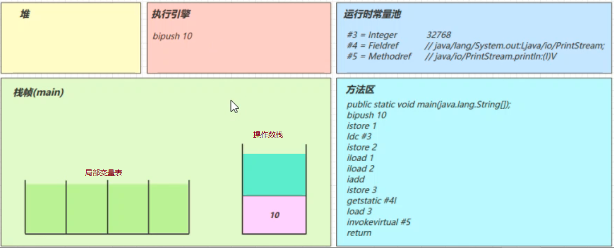

   **2: istore_1**

   + 将数据栈顶数据弹出，存入局部变量表slot 1 

   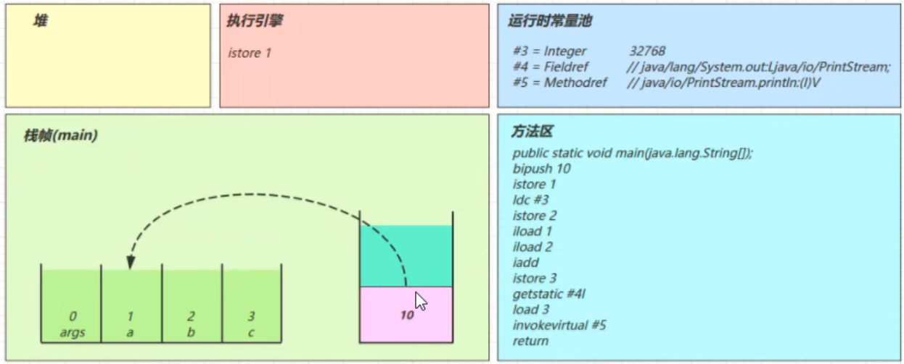

   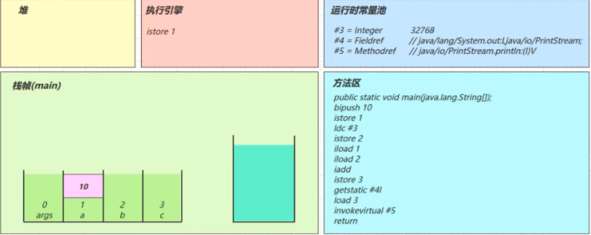

   **3: ldc           #3**

   + 从常量池加载#3数据到操作栈

   + 注意Short.MAX_VALUE 是 32767，所以 32768 = Short.MAX_VALUE + 1 实际是在编译期间计算好的。

     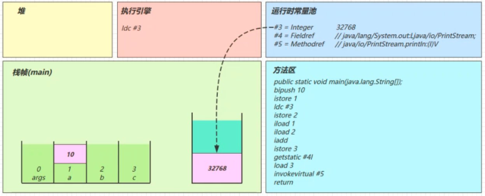

   **5: istore_2**

   + 将数据栈顶数据弹出，存入局部变量表slot 12

     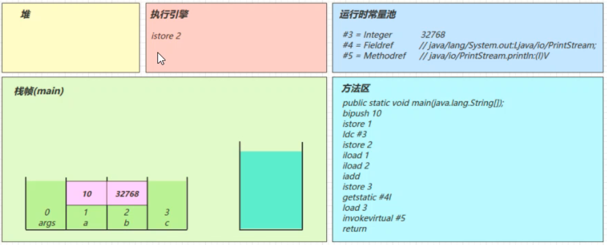

   **6: iload_1   7: iload_2**

   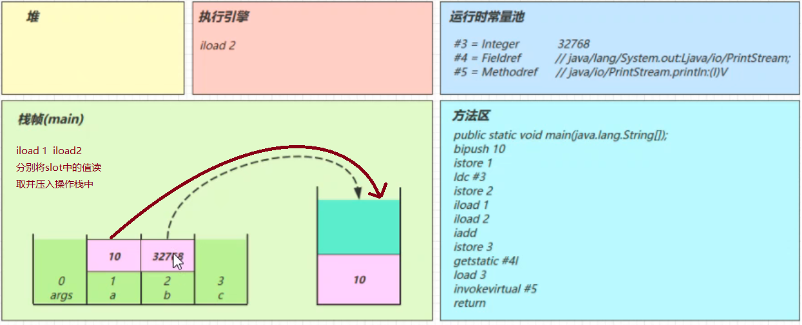

   **8: iadd**

   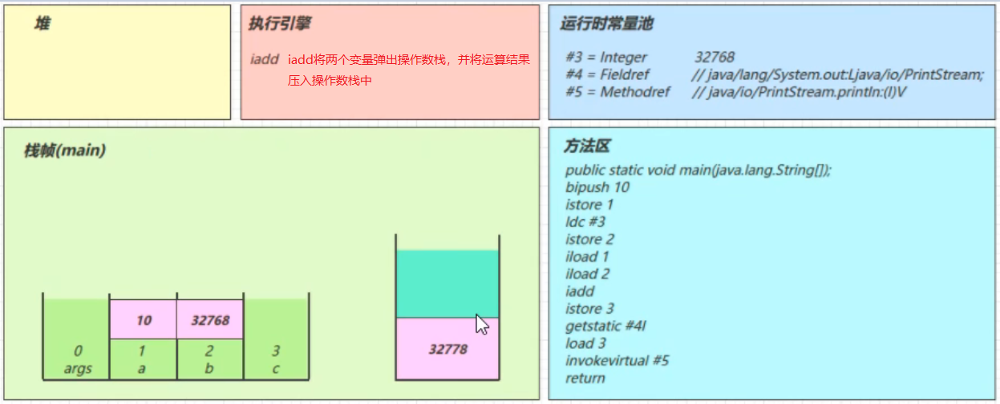

   **9: istore_3**

   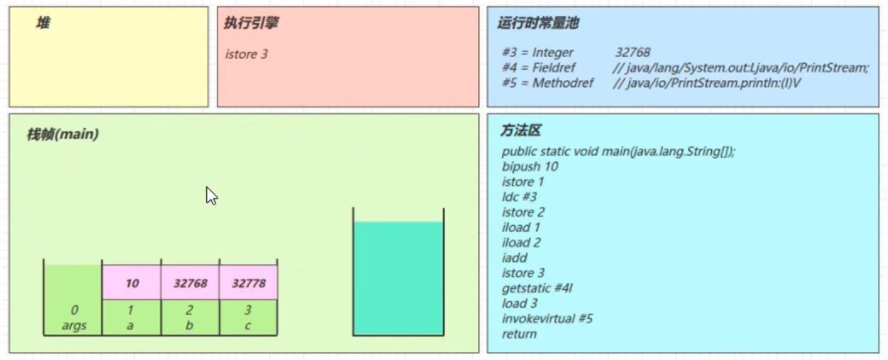

   **10: getstatic     #4**  

   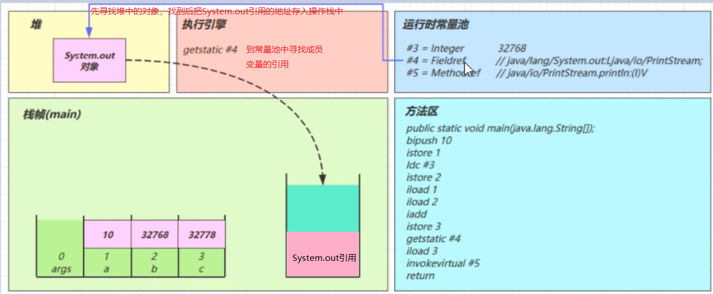

   **13: iload_3**

   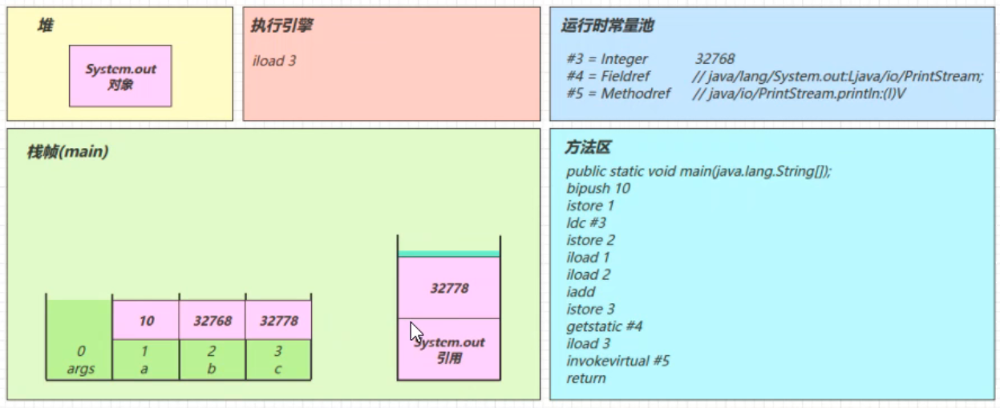

   **14: invokevirtual #5**   

   + 找到常量池的#5项， 定位到方法区 java/io/PrintStream.println:(I)V 方法
   + 生成新的栈帧（分配 locals、stack等）
   + 传递参数，执行新栈帧中的字节码

   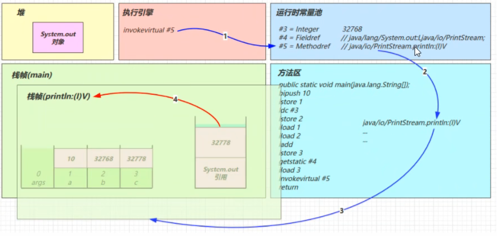

   执行完毕，弹出栈帧，清除 main 操作数栈内容

   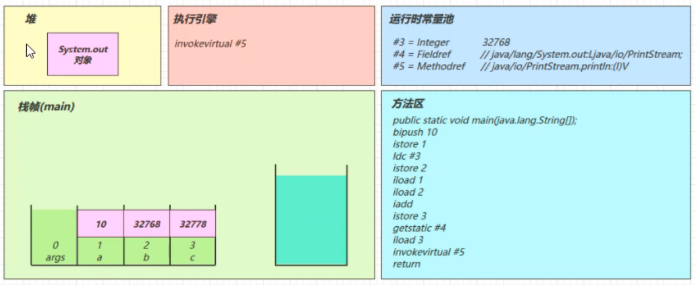

   **17: return**

   + 完成main方法调用，弹出main栈帧

   + 程序结束

#### 2.1.2 通过字节码指令分析问题

```java
public static void main(String[] args) {

    int i = 0;
    int x = 0;
    while (i < 10) {
        x = x++;
        i++;
    }
    System.out.println(x); // 0
}
```

```java
Code:
     stack=2, locals=3, args_size=1	// 操作数栈分配2个空间，局部变量表分配 3 个空间
        0: iconst_0	// 准备一个常数 0
        1: istore_1	// 将常数 0 放入局部变量表的 1 号槽位 i = 0
        2: iconst_0	// 准备一个常数 0
        3: istore_2	// 将常数 0 放入局部变量的 2 号槽位 x = 0	
        4: iload_1		// 将局部变量表 1 号槽位的数放入操作数栈中
        5: bipush        10	// 将数字 10 放入操作数栈中，此时操作数栈中有 2 个数
        7: if_icmpge     21	// 比较操作数栈中的两个数，如果下面的数大于上面的数，就跳转到 21 。这里的比较是将两个数做减法。因为涉及运算操作，所以会将两个数弹出操作数栈来进行运算。运算结束后操作数栈为空
       10: iload_2		// 将局部变量 2 号槽位的数放入操作数栈中，放入的值是 0 
       11: iinc          2, 1	// 将局部变量 2 号槽位的数加 1 ，自增后，槽位中的值为 1 
       14: istore_2	//将操作数栈中的数放入到局部变量表的 2 号槽位，2 号槽位的值又变为了0
       15: iinc          1, 1 // 1 号槽位的值自增 1 
       18: goto          4 // 跳转到第4条指令
       21: getstatic     #2                  // Field java/lang/System.out:Ljava/io/PrintStream;
       24: iload_2
       25: invokevirtual #3                  // Method java/io/PrintStream.println:(I)V
       28: return
// 但是不用字节码分析的话原因就是x++在自增前就赋值给了x，导致x一直是0.改为++x结果就是10
```

#### 2.1.3 构造方法

1. **`<cinit>()V`**

   整个类的构造方法

   ```java
   static int i = 10;
       static{
           i = 20;
       }
       static{
           i = 30;
       }
   ```

   ```java
   static {};
       descriptor: ()V
       flags: ACC_STATIC
       Code:
         stack=1, locals=0, args_size=0
            0: bipush        10
            2: putstatic     #3                  // Field i:I
            5: bipush        20
            7: putstatic     #3                  // Field i:I
           10: bipush        30
           12: putstatic     #3                  // Field i:I
           15: return
   ```

   编译器会按从上往下的顺序，收集所有static静态代码块和静态成员赋值的代码，合并为一个特殊的方法**`<cinit>()V`**

2. **`<init>()V`**

   每个实例对象的构造方法

   ```java
   public class test {
       private String a = "s1";
   
       {
           b = 20;
       }
   
       private int b = 10;
   
       {
           a = "s2";
       }
   
       public test(String a, int b) {
           this.a = a;
           this.b = b;
       }
   
       public static void main(String[] args) {
           test d = new test("s3", 30);
           System.out.println(d.a);
           System.out.println(d.b);
       }
   }
   ```

   ```java
   public com.JVM.test(java.lang.String, int);
       descriptor: (Ljava/lang/String;I)V
       flags: ACC_PUBLIC
       Code:
         stack=2, locals=3, args_size=3
            0: aload_0
            1: invokespecial #1                  // Method java/lang/Object."<init>":()V
            4: aload_0
            5: ldc           #2                  // String s1
            7: putfield      #3                  // Field a:Ljava/lang/String;
           10: aload_0
           11: bipush        20
           13: putfield      #4                  // Field b:I
           16: aload_0
           17: bipush        10
           19: putfield      #4                  // Field b:I
           22: aload_0
           23: ldc           #5                  // String s2
           25: putfield      #3                  // Field a:Ljava/lang/String;
           // 原始构造方法在最后执行
           // 原始构造方法执行开始
           28: aload_0
           29: aload_1
           30: putfield      #3                  // Field a:Ljava/lang/String;
           33: aload_0
           34: iload_2
           35: putfield      #4                  // Field b:I
           // 原始构造方法执行结束
           38: return
   ```

   编译器会从上往下执行，收集{}代码块和成员变量赋值的代码，形成新的构造方法，但原始构造方法内的代码总是在最后

3. 方法调用

   ```java
   public class test {
       public test() {
       }
   
       private void test1() {
       }
   
       private final void test2() {
       }
   
       public void test3() {
       }
   
       public static void test4() {
       }
   
       public static void main(String[] args) {
           test obj = new test();
           obj.test1();
           obj.test2();
           obj.test3();
           test.test4();
       }
   }
   ```

   不同方法在调用时，对应的虚拟机指令有所区别

   + 私有、构造、被 final 修饰的方法，在调用时都使用 invokespecial 指令
   + 普通成员方法在调用时，使用 invokevirtual 指令。因为编译期间无法确定该方法的内容，只有在运行期间才能确定
   + 静态方法在调用时使用 invokestatic 指令

   ```java
   public static void main(java.lang.String[]);
       descriptor: ([Ljava/lang/String;)V
       flags: ACC_PUBLIC, ACC_STATIC
       Code:
         stack=2, locals=2, args_size=1
            0: new           #2                  // class com/JVM/test 
            3: dup
            4: invokespecial #3                  // Method "<init>":()V   构造、私有、final方法调用指令（静态绑定）
            7: astore_1
            8: aload_1
            9: invokespecial #4                  // Method test1:()V
           12: aload_1
           13: invokespecial #5                  // Method test2:()V
           16: aload_1
           17: invokevirtual #6                  // Method test3:()V	普通方法（public）调用指令
           20: invokestatic  #7                  // Method test4:()V	静态方法调用指令（静态绑定）
           23: return
   ```

   + new 是创建【对象】，给对象分配堆内存，执行成功会将【对象引用】压入操作数栈
   + dup 是赋值操作数栈栈顶的内容，本例即为【对象引用】，为什么需要两份引用呢，一个是要配合 invokespecial 调用该对象的构造方法 “init”: ()V （会消耗掉栈顶一个引用），另一个要 配合 astore_1 赋值给局部变量
   + 终方法（final），私有方法（private），构造方法都是由 invokespecial 指令来调用，属于静态绑定
   + 普通成员方法是由 invokevirtual 调用，属于动态绑定，即支持多态 成员方法与静态方法调用的另一个区别是，执行方法前是否需要【对象引用】

----

#### 2.1.4 多态原理

因为普通成员方法需要在运行时才能确定具体的内容，所以虚拟机需要调用 invokevirtual 指令。
在执行 invokevirtual 指令时，经历了以下几个步骤

+ 先通过栈帧中对象的引用找到对象
+ 分析对象头，找到对象实际的 Class
+ Class 结构中有 vtable（虚方法表），它在类加载阶段就已经根据方法的重写规则生效了
+ 查询 vtable 找到方法的具体地址
+ 执行方法的字节码

----

#### 2.1.5 异常处理

1. **try_catch**

   ```java
   public static void main(String[] args) {
       int i = 0;
       try {
           i = 10;
       }catch (Exception e) {
           i = 20;
       }
   }
   ```

   对应字节码：

   ```java
   Code:
        stack=1, locals=3, args_size=1
           0: iconst_0
           1: istore_1
           2: bipush        10
           4: istore_1
           5: goto          12
           8: astore_2
           9: bipush        20
          11: istore_1
          12: return
        //多出来一个异常表
        Exception table:
           from    to  target type	// 检测第二行-第五行代码（[））也就是2-4行代码
               2     5     8   Class java/lang/Exception
   ```

   + 可以看到多出来一个 Exception table 的结构，[from, to) 是前闭后开（也就是检测 2~4 行）的检测范围，一旦这个范围内的字节码执行出现异常，则通过 type 匹配异常类型，如果一致，进入 target 所指示行号
   + 8 行的字节码指令 astore_2 是将异常对象引用存入局部变量表的 2 号位置（为 e ）

2. **多个 single-catch**

   ```java
   public static void main(String[] args) {
       int i = 0;
       try {
           i = 10;
       }catch (ArithmeticException e) {
           i = 20;
       }catch (Exception e) {
           i = 30;
       }
   }
   ```

   ```java
   Code:
        stack=1, locals=3, args_size=1
           0: iconst_0
           1: istore_1
           2: bipush        10
           4: istore_1
           5: goto          19
           8: astore_2
           9: bipush        20
          11: istore_1
          12: goto          19
          15: astore_2
          16: bipush        30
          18: istore_1
          19: return
        Exception table:
           from    to  target type
               2     5     8   Class java/lang/ArithmeticException
               2     5    15   Class java/lang/Exception
   ```

   - 因为异常出现时，只能进入 Exception table 中一个分支，所以局部变量表 slot 2 位置被共用

3. **finally**

   ```java
   public static void main(String[] args) {
       int i = 0;
       try {
           i = 10;
       } catch (Exception e) {
           i = 20;
       } finally {
           i = 30;
       }
   }
   ```

   ```java
   Code:
        stack=1, locals=4, args_size=1
           0: iconst_0
           1: istore_1
           // try块
           2: bipush        10
           4: istore_1
           // try块执行完后，会执行finally    
           5: bipush        30
           7: istore_1
           8: goto          27
          // catch块     
          11: astore_2 // 异常信息放入局部变量表的2号槽位
          12: bipush        20
          14: istore_1
          // catch块执行完后，会执行finally        
          15: bipush        30
          17: istore_1
          18: goto          27
          // 出现异常，但未被 Exception 捕获，会抛出其他异常，这时也需要执行 finally 块中的代码   
          21: astore_3
          22: bipush        30
          24: istore_1
          25: aload_3
          26: athrow  // 抛出异常
          27: return
        Exception table:
           from    to  target type
               2     5    11   Class java/lang/Exception
               2     5    21   any
              11    15    21   any
   ```

   + 可以看到 finally 中的代码被复制了 3 份，分别放入 try 流程，catch 流程以及 catch 剩余的异常类型流程
   + 注意：虽然从字节码指令看来，每个块中都有 finally 块，但是 finally 块中的代码只会被执行一次

4. **finally 中的 return**

   ```java
   public static void main(String[] args) {
       int i = Code_18_FinallyReturnTest.test();
       // 结果为 20
       System.out.println(i);
   }
   
   public static int test() {
       int i;
       try {
           i = 10;
           return i;
       } finally {
           i = 20;
           return i;
       }
   }
   ```

   ```java
   Code:
        stack=1, locals=3, args_size=0
           0: bipush        10
           2: istore_0
           3: iload_0
           4: istore_1  // 暂存返回值
           5: bipush        20
           7: istore_0
           8: iload_0
           9: ireturn	// ireturn 会返回操作数栈顶的整型值 20
          // 如果出现异常，还是会执行finally 块中的内容，没有抛出异常
          10: astore_2
          11: bipush        20
          13: istore_0
          14: iload_0
          15: ireturn	// 这里没有 athrow 了，也就是如果在 finally 块中如果有返回操作的话，且 try 块中出现异常，会吞掉异常！
        Exception table:
           from    to  target type
               0     5    10   any
   ```

   + 由于 finally 中的 ireturn 被插入了所有可能的流程，因此返回结果肯定以finally的为准
   + 至于字节码中第 2 行，似乎没啥用，且留个伏笔，看下个例子
   + 跟上例中的 finally 相比，发现没有 athrow 了，这告诉我们：如果在 finally 中出现了 return，会吞掉异常
   + 所以不要在finally中进行返回操作

5. **finally 不带 return**

   ```java
   public static int test() {
       int i = 10;
       try {
           return i;
       } finally {
           i = 20;
       }
   }
   ```

   ```java
   Code:
        stack=1, locals=3, args_size=0
           0: bipush        10			// 10放入操作数栈栈顶
           2: istore_0 				// 将10从操作数栈存放到局部变量表第一个位置，实际就是赋值 10->i,
           3: iload_0					// 加载局部变量表第一个位置的变量到操作数栈顶
           4: istore_1 				// 加载到局部变量表的1号槽（实际是第二个位置）,这个操作是暂存返回值，目的是固定返回值
           5: bipush        20			// 20放入操作栈栈顶
           7: istore_0 				// 赋值 20 -> i 
           8: iload_1 					// 加载局部变量表1号槽的变量10到操作数栈
           9: ireturn 					// 返回操作数栈顶元素 10
          10: astore_2					// 异常对象存储到局部变量表第三个位置
          11: bipush        20			// 20放入操作栈栈顶
          13: istore_0					// 赋值 20 -> i 
          14: aload_2 					// 加载异常
          15: athrow 					// 抛出异常
        Exception table:
           from    to  target type
               3     5    10   any
        LocalVariableTable:
           Start  Length  Slot  Name   Signature
               3      13     0    i   I
   ```

6. **Synchronized**

   ```java
   public static void main(String[] args) {
       Object lock = new Object();
       synchronized (lock) {
           System.out.println("ok");
       }
   }
   ```

   ```java
   Code:
         stack=2, locals=4, args_size=1
            0: new           #2                 	// class java/lang/Object
            3: dup 								// 复制一份栈顶，然后压入栈中。用于函数消耗
            4: invokespecial #1                  	// Method java/lang/Object."<init>":()V
            7: astore_1 							// 将栈顶的对象地址方法 局部变量表中 1 中
            8: aload_1 							// 加载到操作数栈
            9: dup 								// 复制一份，放到操作数栈，用于加锁时消耗
           10: astore_2 							// 将操作数栈顶元素弹出，暂存到局部变量表的 2 号槽位。这时操作数栈中有一份对象的引用
           11: monitorenter 						// 加锁,消耗了一份lock的引用
           12: getstatic     #3                  	// Field java/lang/System.out:Ljava/io/PrintStream;
           15: ldc           #4                  	// String ok
           17: invokevirtual #5                  	// Method java/io/PrintStream.println:(Ljava/lang/String;)V
           20: aload_2								// 加载对象到栈顶
           21: monitorexit 						// 释放锁
           22: goto          30
           // 异常情况的解决方案 释放锁！
           25: astore_3
           26: aload_2
           27: monitorexit
           28: aload_3
           29: athrow
           30: return
           // 异常表！
         Exception table:
            from    to  target type
               12    22    25   any
               25    28    25   any
   ```

### 2.2 编译期处理

所谓的**语法糖** ，其实就是指 java 编译器把 .java 源码编译为 .class 字节码的过程中，自动生成和转换的一些代码，主要是为了减轻程序员的负担，算是 java 编译器给我们的一个额外福利
**注意**，以下代码的分析，借助了 javap 工具，idea 的反编译功能，idea 插件 jclasslib 等工具。另外， 编译器转换的结果**直接就是 class 字节码**，只是为了便于阅读，给出了 几乎等价 的 java 源码方式，并不是编译器还会转换出中间的 java 源码，切记。

#### 2.2.1 默认构造器

```java
public class Candy1 {
}
```

经过编译期优化后

```java
public class Candy1 {
   // 这个无参构造器是java编译器帮我们加上的
   public Candy1() {
      // 即调用父类 Object 的无参构造方法，即调用 java/lang/Object." <init>":()V
      super();
   }
}
```

#### 2.2.2 自动拆装箱

基本类型和其包装类型的相互转换过程，称为拆装箱
在 JDK 5 以后，它们的转换可以在编译期自动完成

```java
public class Candy2 {
   public static void main(String[] args) {
      Integer x = 1;
      int y = x;
   }
}
```

转换过程如下

```java
public class Candy2 {
   public static void main(String[] args) {
      // 基本类型赋值给包装类型，称为装箱
      Integer x = Integer.valueOf(1);
      // 包装类型赋值给基本类型，称为拆箱
      int y = x.intValue();
   }
}
```

#### 2.2.3 泛型集合取值

泛型也是在 JDK 5 开始加入的特性，但 java 在编译泛型代码后会执行泛型擦除的动作，即泛型信息在编译为字节码之后就丢失了，实际的类型都当做了 Object 类型来处理：

```java
public class Candy3 {
   public static void main(String[] args) {
      List<Integer> list = new ArrayList<>();
      list.add(10);
      Integer x = list.get(0);
   }
}
```

对应字节码

```java
Code:
    stack=2, locals=3, args_size=1
       0: new           #2                  // class java/util/ArrayList
       3: dup
       4: invokespecial #3                  // Method java/util/ArrayList."<init>":()V
       7: astore_1
       8: aload_1
       9: bipush        10
      11: invokestatic  #4                  // Method java/lang/Integer.valueOf:(I)Ljava/lang/Integer;
      // 这里进行了泛型擦除，实际调用的是add(Objcet o)
      14: invokeinterface #5,  2            // InterfaceMethod java/util/List.add:(Ljava/lang/Object;)Z
      19: pop
      20: aload_1
      21: iconst_0
      // 这里也进行了泛型擦除，实际调用的是get(Object o)   
      22: invokeinterface #6,  2            // InterfaceMethod java/util/List.get:(I)Ljava/lang/Object;
	  // 这里进行了类型转换，将 Object 转换成了 Integer
      27: checkcast     #7                  // class java/lang/Integer
      30: astore_2
      31: return
```

所以调用 get 函数取值时，有一个类型转换的操作。

```java
Integer x = (Integer) list.get(0);
```

如果要将返回结果赋值给一个 int 类型的变量，则还有自动拆箱的操作

```java
int x = (Integer) list.get(0).intValue();
```

使用反射可以得到，参数的类型以及泛型类型。泛型反射代码如下：

```java
public static void main(String[] args) throws NoSuchMethodException {
    // 1. 拿到方法
    Method method = Code_20_ReflectTest.class.getMethod("test", List.class, Map.class);
    // 2. 得到泛型参数的类型信息
    Type[] types = method.getGenericParameterTypes();
    for(Type type : types) {
        // 3. 判断参数类型是否，带泛型的类型。
        if(type instanceof ParameterizedType) {
            ParameterizedType parameterizedType = (ParameterizedType) type;

            // 4. 得到原始类型
            System.out.println("原始类型 - " + parameterizedType.getRawType());
            // 5. 拿到泛型类型
            Type[] arguments = parameterizedType.getActualTypeArguments();
            for(int i = 0; i < arguments.length; i++) {
                System.out.printf("泛型参数[%d] - %s\n", i, arguments[i]);
            }
        }
    }
}

public Set<Integer> test(List<String> list, Map<Integer, Object> map) {
    return null;
}
```

输出：

```java
原始类型 - interface java.util.List
泛型参数[0] - class java.lang.String
原始类型 - interface java.util.Map
泛型参数[0] - class java.lang.Integer
泛型参数[1] - class java.lang.Object
```

#### 2.2.4 可变参数

```java
public class Candy4 {
   public static void foo(String... args) {
      // 将 args 赋值给 arr ，可以看出 String... 实际就是 String[]  
      String[] arr = args;
      System.out.println(arr.length);
   }

   public static void main(String[] args) {
      foo("hello", "world");
   }
}
```

可变参数 String… args 其实是一个 String[] args ，从代码中的赋值语句中就可以看出来。 同 样 java 编译器会在编译期间将上述代码变换为：

```java
public class Candy4 {
   public Candy4 {}
   public static void foo(String[] args) {
      String[] arr = args;
      System.out.println(arr.length);
   }

   public static void main(String[] args) {
      foo(new String[]);
   }
}
```

注意，如果调用的是 foo() ，即未传递参数时，等价代码为 foo(new String[]{}) ，创建了一个空数组，而不是直接传递的 null 

#### 2.2.5 foreach 循环
仍是 JDK 5 开始引入的语法糖，数组的循环：

```java
public class Candy5 {
	public static void main(String[] args) {
        // 数组赋初值的简化写法也是一种语法糖。
		int[] arr = {1, 2, 3, 4, 5};
		for(int x : arr) {
			System.out.println(x);
		}
	}
}
```

编译器会帮我们转换为

```java
public class Candy5 {
    public Candy5() {}
    public static void main(String[] args) {
        int[] arr = new int[]{1, 2, 3, 4, 5};
        for(int i = 0; i < arr.length; ++i) {
            int x = arr[i];
            System.out.println(x);
        }
    }
}
```
如果是集合使用 foreach

```java
public class Candy5 {
    public static void main(String[] args) {
        List<Integer> list = Arrays.asList(1, 2, 3, 4, 5);
        for (Integer x : list) {
            System.out.println(x);
        }
    }
}
```

集合要使用 foreach ，需要该集合类实现了 Iterable 接口，因为集合的遍历需要用到迭代器 Iterator.

```java
public class Candy5 {
    public Candy5(){}
    
   public static void main(String[] args) {
      List<Integer> list = Arrays.asList(1, 2, 3, 4, 5);
      // 获得该集合的迭代器
      Iterator<Integer> iterator = list.iterator();
      while(iterator.hasNext()) {
         Integer x = iterator.next();
         System.out.println(x);
      }
   }
}
```

#### 2.2.6 switch字符串

从 JDK 7 开始，switch 可以作用于字符串和枚举类，这个功能其实也是语法糖，例如：

```java
public class Cnady6 {
   public static void main(String[] args) {
      String str = "hello";
      switch (str) {
         case "hello" :
            System.out.println("h");
            break;
         case "world" :
            System.out.println("w");
            break;
         default:
            break;
      }
   }
}
```


在编译器中执行的操作：switch实际是跟字符串的hashcode做比较

```java
public class Candy6 {
   public Candy6() {
      
   }
   public static void main(String[] args) {
      String str = "hello";
      int x = -1;
      // 通过字符串的 hashCode + value 来判断是否匹配
      switch (str.hashCode()) {
         // hello 的 hashCode
         case 99162322 :
            // 再次比较，因为字符串的 hashCode 有可能相等
            if(str.equals("hello")) {
               x = 0;
            }
            break;
         // world 的 hashCode
         case 11331880 :
            if(str.equals("world")) {
               x = 1;
            }
            break;
         default:
            break;
      }

      // 用第二个 switch 在进行输出判断
      switch (x) {
         case 0:
            System.out.println("h");
            break;
         case 1:
            System.out.println("w");
            break;
         default:
            break;
      }
   }
}
```

过程说明：

+ 在编译期间，单个的 switch 被分为了两个
  + 第一个用来匹配字符串，并给 x 赋值
    + 字符串的匹配用到了字符串的 hashCode ，还用到了 equals 方法
    + 使用 hashCode 是为了提高比较效率，使用 equals 是防止有 hashCode 冲突（如 BM 和 C .）
  + 第二个用来根据x的值来决定输出语句

#### 2.2.7 switch 枚举

```java
enum SEX {
   MALE, FEMALE;
}
public class Candy7 {
   public static void main(String[] args) {
      SEX sex = SEX.MALE;
      switch (sex) {
         case MALE:
            System.out.println("man");
            break;
         case FEMALE:
            System.out.println("woman");
            break;
         default:
            break;
      }
   }
}
```

编译器中执行的代码如下

```java
enum SEX {
   MALE, FEMALE;
}

public class Candy7 {
   /**     
    * 定义一个合成类（仅 jvm 使用，对我们不可见）     
    * 用来映射枚举的 ordinal 与数组元素的关系     
    * 枚举的 ordinal 表示枚举对象的序号，从 0 开始     
    * 即 MALE 的 ordinal()=0，FEMALE 的 ordinal()=1     
    */ 
   static class $MAP {
      // 数组大小即为枚举元素个数，里面存放了 case 用于比较的数字
      static int[] map = new int[2];
      static {
         // ordinal 即枚举元素对应所在的位置，MALE 为 0 ，FEMALE 为 1
         map[SEX.MALE.ordinal()] = 1;
         map[SEX.FEMALE.ordinal()] = 2;
      }
   }

   public static void main(String[] args) {
      SEX sex = SEX.MALE;
      // 将对应位置枚举元素的值赋给 x ，用于 case 操作
      int x = $MAP.map[sex.ordinal()];
      switch (x) {
         case 1:
            System.out.println("man");
            break;
         case 2:
            System.out.println("woman");
            break;
         default:
            break;
      }
   }
}
```

#### 2.2.8 枚举类
JDK 7 新增了枚举类，以前面的性别枚举为例：

```java
enum SEX {
   MALE, FEMALE;
}
```

转换后的代码

```java
public final class Sex extends Enum<Sex> {   
   // 对应枚举类中的元素
   public static final Sex MALE;    
   public static final Sex FEMALE;    
   private static final Sex[] $VALUES;
   
    static {       
    	// 调用构造函数，传入枚举元素的值及 ordinal
    	MALE = new Sex("MALE", 0);    
        FEMALE = new Sex("FEMALE", 1);   
        $VALUES = new Sex[]{MALE, FEMALE}; 
   }
 	
   // 调用父类中的方法
    private Sex(String name, int ordinal) {     
        super(name, ordinal);    
    }
   
    public static Sex[] values() {  
        return $VALUES.clone();  
    }
    public static Sex valueOf(String name) { 
        return Enum.valueOf(Sex.class, name);  
    } 
   
}
```

#### 2.2.9 try-with-resources
JDK 7 开始新增了对需要关闭的资源处理的特殊语法，‘try-with-resources’

```java
try(资源变量 = 创建资源对象) {
	
} catch() {

}
```

其中资源对象需要实现 AutoCloseable 接口，例如 InputStream 、 OutputStream 、 Connection 、 Statement 、 ResultSet 等接口都实现了 AutoCloseable ，使用 try-with- resources 可以不用写 finally 语句块，编译器会帮助生成关闭资源代码，例如：

```java
public class Candy9 { 
	public static void main(String[] args) {
		try(InputStream is = new FileInputStream("d:\\1.txt")){	
			System.out.println(is); 
		} catch (IOException e) { 
			e.printStackTrace(); 
		} 
	} 
}
```

会被转换为：

```java
public class Candy9 { 
    
    public Candy9() { }
   
    public static void main(String[] args) { 
        try {
            InputStream is = new FileInputStream("d:\\1.txt");
            Throwable t = null; 
            try {
                System.out.println(is); 
            } catch (Throwable e1) { 
                // t 是我们代码出现的异常 
                t = e1; 
                throw e1; 
            } finally {
                // 判断了资源不为空 
                if (is != null) { 
                    // 如果我们代码有异常
                    if (t != null) { 
                        try {
                            is.close(); 
                        } catch (Throwable e2) { 
                            // 如果 close 出现异常，作为被压制异常添加
                            t.addSuppressed(e2); 
                        } 
                    } else { 
                        // 如果我们代码没有异常，close 出现的异常就是最后 catch 块中的 e 
                        is.close(); 
                    } 
                } 
            } 
        } catch (IOException e) {
            e.printStackTrace(); 
        } 
    }
}
```

为什么要设计一个 addSuppressed(Throwable e) （添加被压制异常）的方法呢？是为了防止异常信息的丢失（想想 try-with-resources 生成的 fianlly 中如果抛出了异常）：

```java
public class Test6 { 
	public static void main(String[] args) { 
		try (MyResource resource = new MyResource()) { 
			int i = 1/0; 
		} catch (Exception e) { 
			e.printStackTrace(); 
		} 
	} 
}
class MyResource implements AutoCloseable { 
	public void close() throws Exception { 
		throw new Exception("close 异常"); 
	} 
}

```

输出：

```java
java.lang.ArithmeticException: / by zero 
	at test.Test6.main(Test6.java:7) 
	Suppressed: java.lang.Exception: close 异常 
		at test.MyResource.close(Test6.java:18) 
		at test.Test6.main(Test6.java:6)
```

#### 2.2.10 方法重写时的桥接方法
我们都知道，方法重写时对返回值分两种情况：

- 父子类的返回值完全一致
- 子类返回值可以是父类返回值的子类（比较绕口，见下面的例子）

```java
class A { 
	public Number m() { 
		return 1; 
	} 
}
class B extends A { 
	@Override 
	// 子类 m 方法的返回值是 Integer 是父类 m 方法返回值 Number 的子类 	
	public Integer m() { 
		return 2; 
	} 
}

```

对于子类，java 编译器会做如下处理：

```java
class B extends A { 
	public Integer m() { 
		return 2; 
	}
	// 此方法才是真正重写了父类 public Number m() 方法 
	public synthetic bridge Number m() { 
		// 调用 public Integer m() 
		return m(); 
	} 
}
```


其中桥接方法比较特殊，仅对 java 虚拟机可见，并且与原来的 public Integer m() 没有命名冲突，可以用下面反射代码来验证：

```java
public static void main(String[] args) {
    for(Method m : B.class.getDeclaredMethods()) {
        System.out.println(m);
    }
}
```

结果：

```java
public java.lang.Integer cn.ali.jvm.test.B.m()
public java.lang.Number cn.ali.jvm.test.B.m()
```

#### 2.2.11匿名内部类

```java
public class Candy10 {
   public static void main(String[] args) {
      Runnable runnable = new Runnable() {
         @Override
         public void run() {
            System.out.println("running...");
         }
      };
   }
}
```

转换后的代码

```java
public class Candy10 {
   public static void main(String[] args) {
      // 用额外创建的类来创建匿名内部类对象
      Runnable runnable = new Candy10$1();
   }
}

// 创建了一个额外的类，实现了 Runnable 接口
final class Candy10$1 implements Runnable {
   public Demo8$1() {}

   @Override
   public void run() {
      System.out.println("running...");
   }
}
```

引用局部变量的匿名内部类，源代码：

```java
public class Candy11 { 
	public static void test(final int x) { 
		Runnable runnable = new Runnable() { 
			@Override 
			public void run() { 	
				System.out.println("ok:" + x); 
			} 
		}; 
	} 
}
```

转换后代码：

```java
// 额外生成的类 
final class Candy11$1 implements Runnable { 
	int val$x; 
	Candy11$1(int x) { 
		this.val$x = x; 
	}
	public void run() { 
		System.out.println("ok:" + this.val$x); 
	} 
}

public class Candy11 { 
	public static void test(final int x) { 
		Runnable runnable = new Candy11$1(x); 
	} 
}
```

注意：这同时解释了为什么匿名内部类引用局部变量时，局部变量必须是 final 的：因为在创建 Candy11$1 对象时，将 x 的值赋值给了 Candy11$1 对象的 值后，如果不是 final 声明的 x 值发生了改变，匿名内部类则值不一致。

### 2.3 类加载阶段

#### 2.3.1 加载

+ 将类的字节码载入方法区（1.8后为元空间，在本地内存中）中，内部采用 C++ 的 instanceKlass 描述 java 类，它的重要 field 有：
  + _java_mirror 即 java 的类镜像，例如对 String 来说，它的镜像类就是 String.class，作用是把 klass 暴露给 java 使用
  + _super 即父类
  + _fields 即成员变量
  + _methods 即方法
  + _constants 即常量池
  + _class_loader 即类加载器
  + _vtable 虚方法表
  + _itable 接口方法
+ 如果这个类还有父类没有加载，先加载父类
+ 加载和链接可能是交替运行的


+ instanceKlass保存在方法区。JDK 8以后，方法区位于元空间中，而元空间又位于本地内存中
+ _java_mirror则是保存在堆内存中
+ InstanceKlass和*.class(JAVA镜像类)互相保存了对方的地址
+ 类的对象在对象头中保存了*.class的地址。让对象可以通过其找到方法区中的instanceKlass，从而获取类的各种信息

#### 2.3.2 链接

+ **验证:**验证类是否符合 JVM规范，安全性检查

  + 可以使用 UE 等支持二进制的编辑器修改 HelloWorld.class 的魔数，在控制台运行，会提示magic value错误

+ **准备：**为 static 变量分配空间，设置默认值

  + static 变量在 JDK 7 之前存储于 instanceKlass 末尾，从 JDK 7 开始，存储于 _java_mirror 末尾

  + static 变量分配空间和赋值是两个步骤，分配空间在准备阶段完成，赋值在初始化阶段完成

  + 如果 static 变量是 final 的基本类型，以及字符串常量，那么编译阶段值就确定了，赋值在准备阶段完成

  + 如果 static 变量是 final 的，但属于引用类型，那么赋值也会在初始化阶段完成

+ **解析：**将常量池中的符号引用解析为直接引用

#### 2.3.3 初始化

**`<cinit>()v `方法**

初始化即调用` <cinit>()V` ，虚拟机会保证这个类的『构造方法』的线程安全

**发生的时机**
概括得说，类初始化是【懒惰的】

+ main 方法所在的类，总会被首先初始化
+ 首次访问这个类的静态变量或静态方法时
+ 子类初始化，如果父类还没初始化，会引发
+ 子类访问父类的静态变量，只会触发父类的初始化
+ Class.forName

+ new 会导致初始化

不会导致类初始化的情况

+ 访问类的 static final 静态常量（基本类型和字符串）不会触发初始化
+ 类对象.class 不会触发初始化
+ 创建该类的数组不会触发初始化

### 2.4 类加载器

| 名称                                      | 加载那些类            | 说明                        |
| ----------------------------------------- | --------------------- | --------------------------- |
| Bootstrap ClassLoader（启动类加载器）     | JAVA_HOME/jre/lib     | 无法直接访问                |
| Extension ClassLoader(拓展类加载器)       | JAVA_HOME/jre/lib/ext | 上级为Bootstrap，显示为null |
| Application ClassLoader(应用程序类加载器) | classpath             | 上级为Extension             |
| 自定义类加载器                            | 自定义                | 上级为Application           |

#### 2.4.1 启动类加载器

可通过在控制台输入指令，使得类被启动类加载器加载

#### 2.4.2 扩展类加载器

如果 classpath 和 JAVA_HOME/jre/lib/ext 下有同名类，加载时会使用拓展类加载器加载。当应用程序类加载器发现拓展类加载器已将该同名类加载过了，则不会再次加载。

#### 2.4.3 双亲委派模式

双亲委派模式，即调用类加载器ClassLoader 的 loadClass 方法时，查找类的规则。

```java
protected Class<?> loadClass(String name, boolean resolve)
    throws ClassNotFoundException
{
    synchronized (getClassLoadingLock(name)) {
        // 首先查找该类是否已经被该类加载器加载过了
        Class<?> c = findLoadedClass(name);
        // 如果没有被加载过
        if (c == null) {
            long t0 = System.nanoTime();
            try {
                // 看是否被它的上级加载器加载过了 Extension 的上级是Bootstarp，但它显示为null
                if (parent != null) {
                    c = parent.loadClass(name, false);
                } else {
                    // 看是否被启动类加载器加载过
                    c = findBootstrapClassOrNull(name);
                }
            } catch (ClassNotFoundException e) {
                // ClassNotFoundException thrown if class not found
                // from the non-null parent class loader
                //捕获异常，但不做任何处理
            }

            if (c == null) {
                // 如果还是没有找到，先让拓展类加载器调用 findClass 方法去找到该类，如果还是没找到，就抛出异常
                // 然后让应用类加载器去找 classpath 下找该类
                long t1 = System.nanoTime();
                c = findClass(name);

                // 记录时间
                sun.misc.PerfCounter.getParentDelegationTime().addTime(t1 - t0);
                sun.misc.PerfCounter.getFindClassTime().addElapsedTimeFrom(t1);
                sun.misc.PerfCounter.getFindClasses().increment();
            }
        }
        if (resolve) {
            resolveClass(c);
        }
        return c;
    }
}
```

#### 2.4.4 自定义类加载器

**使用场景**

- 想加载非 classpath 随意路径中的类文件
- 通过接口来使用实现，希望解耦时，常用在框架设计
- 这些类希望予以隔离，不同应用的同名类都可以加载，不冲突，常见于 tomcat 容器

**步骤**

- 继承 ClassLoader 父类
- 要遵从双亲委派机制，重写 findClass 方法
  不是重写 loadClass 方法，否则不会走双亲委派机制
- 读取类文件的字节码
- 调用父类的 defineClass 方法来加载类
- 使用者调用该类加载器的 loadClass 方法

**破坏双亲委派模式**

+ 双亲委派模型的第一次“被破坏”其实发生在双亲委派模型出现之前——即JDK1.2面世以前的“远古”时代
  + 建议用户重写findClass()方法，在类加载器中的loadClass()方法中也会调用该方法
+ 双亲委派模型的第二次“被破坏”是由这个模型自身的缺陷导致的
  + 如果有基础类型又要调用回用户的代码，此时也会破坏双亲委派模式
+ 双亲委派模型的第三次“被破坏”是由于用户对程序动态性的追求而导致的
  + 这里所说的“动态性”指的是一些非常“热”门的名词：代码热替换（Hot Swap）、模块热部署（Hot Deployment）等

## 3、运行期优化

### 3.1 即时编译

**分层编译**

JVM 将执行状态分成了 5 个层次：

+ 0层：解释执行，用解释器将字节码翻译为机器码
+ 1层：使用 C1 即时编译器编译执行（不带 profiling）
+ 2层：使用 C1 即时编译器编译执行（带基本的profiling）
+ 3层：使用 C1 即时编译器编译执行（带完全的profiling）
+ 4层：使用 C2 即时编译器编译执行

> profiling 是指在运行过程中收集一些程序执行状态的数据，例如【方法的调用次数】，【循环的回边次数】等

即时编译器（JIT）与解释器的区别

+ 解释器
  + 将字节码解释为机器码，下次即使遇到相同的字节码，仍会执行重复的解释
  + 是将字节码解释为针对所有平台都通用的机器码
+ 即时编译器
  + 将一些字节码编译为机器码，并存入 Code Cache，下次遇到相同的代码，直接执行，无需再编译
  + 根据平台类型，生成平台特定的机器码

对于大部分的不常用的代码，我们无需耗费时间将其编译成机器码，而是采取解释执行的方式运行；另一方面，对于仅占据小部分的热点代码，我们则可以将其编译成机器码，以达到理想的运行速度。 执行效率上简单比较一下 Interpreter < C1 < C2，总的目标是发现热点代码（hotspot名称的由 来），并优化这些热点代码

**逃逸分析**
逃逸分析（Escape Analysis）简单来讲就是，Java Hotspot 虚拟机可以分析新创建对象的使用范围，并决定是否在 Java 堆上分配内存的一项技术

逃逸分析的 JVM 参数如下：

>+ 开启逃逸分析：-XX:+DoEscapeAnalysis
>+ 关闭逃逸分析：-XX:-DoEscapeAnalysis
>+ 显示分析结果：-XX:+PrintEscapeAnalysis

逃逸分析技术在 Java SE 6u23+ 开始支持，并默认设置为启用状态，可以不用额外加这个参数

对象逃逸状态

全局逃逸（GlobalEscape）

+ 即一个对象的作用范围逃出了当前方法或者当前线程，有以下几种场景：
  + 对象是一个静态变量
  + 对象是一个已经发生逃逸的对象
  + 对象作为当前方法的返回值

参数逃逸（ArgEscape）

+ 即一个对象被作为方法参数传递或者被参数引用，但在调用过程中不会发生全局逃逸，这个状态是通过被调方法的字节码确定的

没有逃逸

+ 即方法中的对象没有发生逃逸

### 3.2 方法内联

**内联函数**
内联函数就是在程序编译时，编译器将程序中出现的内联函数的调用表达式用内联函数的函数体来直接进行替换

**JVM内联函数**
C++ 是否为内联函数由自己决定，Java 由编译器决定。Java 不支持直接声明为内联函数的，如果想让他内联，你只能够向编译器提出请求: 关键字 final 修饰 用来指明那个函数是希望被 JVM 内联的，如

```java
public final void doSomething() {  
        // to do something  
}
```

总的来说，一般的函数都不会被当做内联函数，只有声明了final后，编译器才会考虑是不是要把你的函数变成内联函数

JVM内建有许多运行时优化。首先短方法更利于JVM推断。流程更明显，作用域更短，副作用也更明显。如果是长方法JVM可能直接就跪了。

第二个原因则更重要：方法内联

如果JVM监测到一些小方法被频繁的执行，它会把方法的调用替换成方法体本身，如：

```java
private int add4(int x1, int x2, int x3, int x4) { 
    //这里调用了add2方法
    return add2(x1, x2) + add2(x3, x4);  
}  

private int add2(int x1, int x2) {  
    return x1 + x2;  
}
```

方法调用被替换后

```java
private int add4(int x1, int x2, int x3, int x4) {  
    //被替换为了方法本身
    return x1 + x2 + x3 + x4;  
}
```

### 3.3 反射优化

```java
public class Reflect1 {
   public static void foo() {
      System.out.println("foo...");
   }

   public static void main(String[] args) throws NoSuchMethodException, InvocationTargetException, IllegalAccessException {
      Method foo = Demo3.class.getMethod("foo");
      for(int i = 0; i<=16; i++) {
         foo.invoke(null);
      }
   }
}
```

foo.invoke 前面 0 ~ 15 次调用使用的是 MethodAccessor 的 NativeMethodAccessorImpl 实现
invoke 方法源码

```java
@CallerSensitive
public Object invoke(Object obj, Object... args)
    throws IllegalAccessException, IllegalArgumentException,
       InvocationTargetException
{
    if (!override) {
        if (!Reflection.quickCheckMemberAccess(clazz, modifiers)) {
            Class<?> caller = Reflection.getCallerClass();
            checkAccess(caller, clazz, obj, modifiers);
        }
    }
    //MethodAccessor是一个接口，有3个实现类，其中有一个是抽象类
    MethodAccessor ma = methodAccessor;             // read volatile
    if (ma == null) {
        ma = acquireMethodAccessor();
    }
    return ma.invoke(obj, args);
}
```

会由 DelegatingMehodAccessorImpl 去调用 NativeMethodAccessorImpl
NativeMethodAccessorImpl 源码

```java
class NativeMethodAccessorImpl extends MethodAccessorImpl {
    private final Method method;
    private DelegatingMethodAccessorImpl parent;
    private int numInvocations;

    NativeMethodAccessorImpl(Method var1) {
        this.method = var1;
    }
	
	//每次进行反射调用，会让numInvocation与ReflectionFactory.inflationThreshold的值（15）进行比较，并使使得numInvocation的值加一
	//如果numInvocation>ReflectionFactory.inflationThreshold，则会调用本地方法invoke0方法
    public Object invoke(Object var1, Object[] var2) throws IllegalArgumentException, InvocationTargetException {
        if (++this.numInvocations > ReflectionFactory.inflationThreshold() && !ReflectUtil.isVMAnonymousClass(this.method.getDeclaringClass())) {
            MethodAccessorImpl var3 = (MethodAccessorImpl)(new MethodAccessorGenerator()).generateMethod(this.method.getDeclaringClass(), this.method.getName(), this.method.getParameterTypes(), this.method.getReturnType(), this.method.getExceptionTypes(), this.method.getModifiers());
            this.parent.setDelegate(var3);
        }

        return invoke0(this.method, var1, var2);
    }

    void setParent(DelegatingMethodAccessorImpl var1) {
        this.parent = var1;
    }

    private static native Object invoke0(Method var0, Object var1, Object[] var2);
}
```

```java
//ReflectionFactory.inflationThreshold()方法的返回值
private static int inflationThreshold = 15;
```

+ 一开始if条件不满足，就会调用本地方法 invoke0
+ 随着 numInvocation 的增大，当它大于 ReflectionFactory.inflationThreshold 的值 16 时，就会本地方法访问器替换为一个运行时动态生成的访问器，来提高效率
  + 这时会从反射调用变为正常调用，即直接调用 Reflect1.foo()

